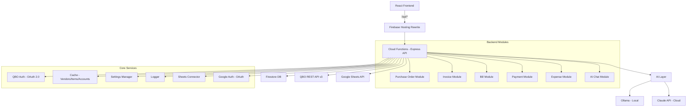

# ATD QBO Platform - Comprehensive Audit Report

**Date:** 2026-04-09  
**Auditor:** Kilo Code (Architect Mode)  
**Scope:** Complete project audit covering security, correctness, code quality, documentation, testing, deployment, and cleanup.  
**Prior Audit:** [`plans/FINALIZATION_AUDIT.md`](FINALIZATION_AUDIT.md) identified 27 items. This audit validates which were resolved and identifies new/additional issues.

---

## Executive Summary

The ATD QBO Platform is an internal automation tool connecting Google Sheets and a web app to QuickBooks Online for American Tile Depot. It features 6 modules (Purchase Orders, Invoices, Bills, Payments, Expenses, Vendor Management), an AI layer (Ollama + Claude), and a React frontend.

**Current State:** Functional but not production-hardened. Backend modules are implemented. Frontend pages exist for all modules. The prior audit (FINALIZATION_AUDIT.md) found 27 issues, nearly all of which **remain unresolved**. This audit confirms those findings and adds additional discoveries.

---

## Audit Results by Category

### 1. SECURITY (Critical - Must Fix Before Production)

| # | Issue | Location | Status |
|---|-------|----------|--------|
| S1 | No authentication on API routes | [`functions/index.js:28`](../functions/index.js:28) | **OPEN** - Express app has zero auth middleware. All routes are fully public. |
| S2 | Firestore rules too permissive | [`firestore.rules:5`](../firestore.rules:5) | **OPEN** - `allow read, write: if request.auth != null` grants any authenticated user full access to everything including OAuth tokens. |
| S3 | Hardcoded QBO account IDs | [`functions/api/routes.js:673`](../functions/api/routes.js:673) | **PARTIALLY FIXED** - Settings has defaults now (`default_income_account`, etc.) but routes still fallback to hardcoded `'80'`, `'81'`, `'67'`. |
| S4 | `po_sheet_id` default was hardcoded | [`functions/core/settings.js:9`](../functions/core/settings.js:9) | **FIXED** - Default is now empty string `''`. |
| S5 | No CORS restriction | [`functions/index.js`](../functions/index.js) | **OPEN** - No CORS middleware configured despite CLAUDE.md stating CORS should be configured for Firebase Hosting domain only. |

### 2. BUGS AND ERRORS (Must Fix)

| # | Issue | Location | Status |
|---|-------|----------|--------|
| B1 | Missing favicon file | [`frontend/index.html:5`](../frontend/index.html:5) | **OPEN** - References `/atd-icon.svg` but no `frontend/public/` directory or SVG file exists. 404 on every page load. |
| B2 | Vite proxy path mismatch | [`frontend/vite.config.js:8`](../frontend/vite.config.js:8) | **OPEN** - Proxies `/api` to `http://localhost:5001` but Firebase emulator serves at `http://localhost:5001/atd-qbo-platform/us-central1/api`. Dev mode API calls fail without manual workaround. |
| B3 | `getQboBaseUrl` duplicated with different logic | [`functions/core/cache.js:9`](../functions/core/cache.js:9) vs [`functions/core/qbo-auth.js:168`](../functions/core/qbo-auth.js:168) | **OPEN** - Two different implementations. `cache.js` uses `settings.qbo.production_base_url` / `settings.qbo.sandbox_base_url`. `qbo-auth.js` uses inline URL strings. Inconsistent behavior possible. |
| B4 | `NewDashboard.jsx` duplicates utility functions | [`frontend/src/pages/NewDashboard.jsx:36`](../frontend/src/pages/NewDashboard.jsx:36) | **OPEN** - Defines local `formatCurrency()`, `formatDateTime()`, `isToday()` instead of importing from [`helpers.js`](../frontend/src/utils/helpers.js). |
| B5 | `logger.js` missing `'use strict'` directive | [`functions/core/logger.js:1`](../functions/core/logger.js:1) | **OPEN** - Only backend file missing `'use strict'`. Every other backend file has it. |
| B6 | Version mismatch across project | Multiple locations | **OPEN** - [`routes.js:1640`](../functions/api/routes.js:1640) returns `'0.1.0'`, [`functions/package.json:27`](../functions/package.json:27) says `"0.1.1"`, [`AppLayout.jsx:5`](../frontend/src/components/shared/AppLayout.jsx:5) defaults to `'v0.1.0'`. |
| B7 | `NewDashboard.jsx` imports entire `PurchaseOrders` page | [`frontend/src/pages/NewDashboard.jsx:31`](../frontend/src/pages/NewDashboard.jsx:31) | **OPEN** - `import PurchaseOrders from './PurchaseOrders'` imports the full 67K char page component into Dashboard, defeating the purpose of lazy loading in `App.jsx`. |

### 3. DOCUMENTATION (Outdated/Incorrect)

| # | Issue | Location | Status |
|---|-------|----------|--------|
| D1 | README says modules are "Coming soon" | [`README.md:7-9`](../README.md:7) | **OPEN** - Invoices, Bills, Payments all listed as "(Coming soon)" but are fully implemented. |
| D2 | CLAUDE.md architecture tree is wrong | [`CLAUDE.md:53`](../CLAUDE.md:53) | **OPEN** - Shows flat files (`purchase-order.js`) but actual structure uses directories (`purchase-order/index.js`). Also lists `sheets-sync.js` but actual file is `sheets-connector.js`. Missing `google-auth.js` and `settings.js`. |
| D3 | CLAUDE.md module roadmap is outdated | [`CLAUDE.md:139`](../CLAUDE.md:139) | **OPEN** - Invoice/Bill/Payment shown as "Building", Vendor Management as "Planned". All are implemented. |
| D4 | README references deprecated v1 config pattern | [`README.md:32`](../README.md:32) | **OPEN** - `firebase functions:config:set qbo.client_id=...` is v1. Project uses v2 `functions/.env` pattern. |
| D5 | Root `.env.example` duplicates guidance | [`.env.example`](../.env.example) | **Note** - Correctly explains that `functions/.env` is the right location. This is fine but the README contradicts it. |

### 4. CODING CONVENTION VIOLATIONS

| # | Issue | Location | Status |
|---|-------|----------|--------|
| C1 | Em dashes in user-facing text (15 instances) | Multiple files | **OPEN** - CLAUDE.md rule: "No em dashes in any user-facing text." Found in: [`Settings.jsx:414`](../frontend/src/pages/Settings.jsx:414), [`Expenses.jsx`](../frontend/src/pages/Expenses.jsx) (8 instances), [`QBOConnect.jsx:228`](../frontend/src/pages/QBOConnect.jsx:228), [`Help.jsx:142`](../frontend/src/pages/Help.jsx:142) (2), and code comments (4). |
| C2 | `console.error` used instead of Toast in frontend | 11 instances across 6 files | **OPEN** - Frontend pages catch errors and only `console.error` them, leaving users with no indication of failure. Should use Toast component for user-facing errors. |

### 5. DEAD CODE AND CLEANUP

| # | Issue | Location | Status |
|---|-------|----------|--------|
| X1 | No `frontend/public/` directory | Project root | **OPEN** - No directory for static assets (favicon, robots.txt, etc.). |
| X2 | `comingSoonItems` array is empty | [`AppLayout.jsx:41`](../frontend/src/components/shared/AppLayout.jsx:41) | **OPEN** - Empty array that may render an empty "Coming Soon" section. |
| X3 | Stale plan/review docs in `docs/` and `plans/` | `docs/FRONTEND_REVIEW.md`, `docs/UI_REVIEW_PART1-3.md`, etc. | **Note** - Previous review artifacts. Decision needed: archive or delete. |
| X4 | `DO NOT UPLOAD - SCREENSHOOTS/` directory | Root | **Note** - Misspelled directory name. Listed in `.gitignore`. Should consider renaming if kept. |
| X5 | `notes.md` scratch file | Root (if still exists) | **Uncertain** - Prior audit flagged it. May have been deleted already. |

### 6. CODE QUALITY AND ARCHITECTURE

| # | Issue | Location | Impact |
|---|-------|----------|--------|
| Q1 | `routes.js` is a 1650-line monolith | [`functions/api/routes.js`](../functions/api/routes.js) | All route logic for all modules in one file. Hard to maintain and review. Should split into route files per module. |
| Q2 | Frontend page files are extremely large | [`PurchaseOrders.jsx`](../frontend/src/pages/PurchaseOrders.jsx) (67K), [`Invoices.jsx`](../frontend/src/pages/Invoices.jsx) (58K), [`Bills.jsx`](../frontend/src/pages/Bills.jsx) (58K), [`Payments.jsx`](../frontend/src/pages/Payments.jsx) (42K) | Each page file contains all logic, forms, tables, and state in one component. Should extract reusable sub-components. |
| Q3 | Duplicate `getQboBaseUrl` function | [`cache.js:9`](../functions/core/cache.js:9) and [`qbo-auth.js:168`](../functions/core/qbo-auth.js:168) | Two implementations with different fallback logic. DRY violation. Should be consolidated. |
| Q4 | `NewDashboard.jsx` has unused `API_BASE_URL` const | [`NewDashboard.jsx:28`](../frontend/src/pages/NewDashboard.jsx:28) | Defined but appears unused; API calls use the `api` utility. |

### 7. TESTING (Major Gap)

| # | Issue | Details |
|---|-------|---------|
| T1 | Only 2 frontend test files | [`api.test.js`](../frontend/src/utils/api.test.js) and [`helpers.test.js`](../frontend/src/utils/helpers.test.js) - tests only utility functions. |
| T2 | Zero backend tests | No test files exist anywhere under `functions/`. No unit tests for modules, core modules, or routes. |
| T3 | Zero component tests | No React component tests for any page or shared component. |
| T4 | Zero E2E tests | No Playwright, Cypress, or integration tests despite `.playwright-mcp/` directory existing. |
| T5 | Test coverage config only covers `src/utils/` | [`vitest.config.js:13`](../frontend/vitest.config.js:13) - Coverage `include` only covers utils, not pages or components. |

### 8. DEPLOYMENT AND CONFIGURATION

| # | Issue | Location | Status |
|---|-------|----------|--------|
| P1 | Root `package.json` `dev` script uses `npm start` | [`package.json:7`](../package.json:7) | **Needs verification** - docs say `npm run dev` but earlier audit flagged this calling `npm start` instead of `npm run dev`. Current file shows `"dev": "cd frontend && npm run dev"` which appears correct. |
| P2 | No `npm start` script at root level | [`package.json`](../package.json) | Minor - No root-level start script for the full platform (functions + frontend). |
| P3 | Missing `frontend/public/` with favicon and robots.txt | Not present | No static assets directory. |
| P4 | `emulate` script lacks `--import/--export` for data persistence | [`package.json:12`](../package.json:12) | Emulator data lost between restarts. |
| P5 | `scripts/start-emulators.sh` exists but may be redundant | [`scripts/start-emulators.sh`](../scripts/start-emulators.sh) | Small shell script that may duplicate root `npm run emulate`. |

### 9. FEATURE COMPLETENESS

| # | Feature | Status |
|---|---------|--------|
| F1 | Expense module missing from `modules` config defaults | **OPEN** - [`settings.js:81`](../functions/core/settings.js:81) has `expense: { enabled: true, auto_approve: false }` which appears to be present now. Resolved. |
| F2 | No audit trail viewer in frontend | **OPEN** - Logs written to Firestore but no dedicated log viewer page. |
| F3 | No user authentication/login | **OPEN** - Acceptable for internal use behind VPN but risky if publicly exposed. |
| F4 | Invoice/Bill Google Sheets import not implemented | **OPEN** - PO has Sheets import. Other modules do not. |

---

## Summary of Open Issues

| Category | Open Items |
|----------|-----------|
| Security (Critical) | 4 |
| Bugs and Errors | 7 |
| Documentation | 4 |
| Convention Violations | 2 |
| Dead Code/Cleanup | 4 |
| Code Quality | 4 |
| Testing | 5 |
| Deployment/Config | 4 |
| Feature Completeness | 3 |
| **Total Open Items** | **37** |

---

## Architecture Overview

