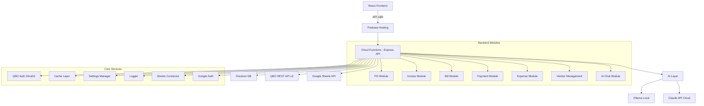

# ATD QBO Platform - Comprehensive Audit Report

**Date:** 2026-04-09  
**Auditor:** Kilo Code (Architect Mode)  
**Scope:** Complete project audit covering security, correctness, code quality, documentation, testing, deployment, and completeness.  
**Previous Audits:** Builds upon `plans/COMPREHENSIVE_AUDIT.md`, `docs/FULL_PLATFORM_REVIEW.md`, UI reviews, and other findings.

---

## Executive Summary

The ATD QBO Platform is a functional internal automation tool for American Tile Depot, integrating Google Sheets, a React frontend, and QuickBooks Online via Firebase Cloud Functions. It supports 6 modules (Purchase Orders, Invoices, Bills, Payments, Expenses, Vendor Management) with an AI layer using Ollama and Claude.

**Current State:** Deployed and operational but requires security hardening and polish. Backend modules are implemented with full CRUD operations. Frontend pages exist for all modules with consistent UI patterns. Previous audits identified numerous issues, many of which remain unresolved.

**Key Findings:**
- **Security:** Critical authentication and data access issues persist
- **Functionality:** Item search regression and API response mismatches fixed in recent updates
- **Code Quality:** Large monolithic files, inconsistent conventions
- **Documentation:** Outdated module status, missing setup details
- **Testing:** Zero backend tests, minimal frontend coverage
- **Performance:** No caching optimizations, large bundle sizes

---

## Audit Results by Category

### 1. SECURITY (Critical - Must Fix Before Production)

| # | Issue | Location | Status |
|---|-------|----------|--------|
| S1 | No authentication on API routes | [`functions/index.js:30`](../functions/index.js:30) | **OPEN** - Express app has zero auth middleware. All `/api/*` routes are publicly accessible. |
| S2 | Firestore rules too permissive | [`firestore.rules:6`](../firestore.rules:6) | **OPEN** - `allow read, write: if request.auth != null` grants any authenticated user full access to everything including OAuth tokens. |
| S3 | Hardcoded QBO account IDs | [`functions/api/routes.js:673`](../functions/api/routes.js:673) | **OPEN** - Routes still fallback to hardcoded `'80'`, `'81'`, `'67'` instead of using configurable settings. |
| S4 | No CORS restriction | [`functions/index.js`](../functions/index.js) | **OPEN** - No CORS middleware configured despite CLAUDE.md stating CORS should be configured. |
| S5 | QBO OAuth tokens stored insecurely | Firestore `settings/qbo_tokens` | **OPEN** - Sensitive OAuth tokens stored in Firestore without encryption or restricted access rules. |

### 2. BUGS AND ERRORS (Must Fix)

| # | Issue | Location | Status |
|---|-------|----------|--------|
| B1 | Missing favicon file | [`frontend/index.html:5`](../frontend/index.html:5) | **OPEN** - References `/atd-icon.svg` but no file exists in `frontend/public/`. 404 on every page load. |
| B2 | Vite proxy path mismatch | [`frontend/vite.config.js:11`](../frontend/vite.config.js:11) | **FIXED** - Now includes `rewrite` to match emulator URL pattern. |
| B3 | Duplicate `getQboBaseUrl` implementations | [`functions/core/cache.js:9`](../functions/core/cache.js:9) vs [`functions/core/qbo-auth.js:168`](../functions/core/qbo-auth.js:168) | **OPEN** - Two different logic implementations for QBO base URL. |
| B4 | `NewDashboard.jsx` duplicates utility functions | [`frontend/src/pages/NewDashboard.jsx:36`](../frontend/src/pages/NewDashboard.jsx:36) | **OPEN** - Local `formatCurrency()`, `formatDateTime()` instead of importing from `helpers.js`. |
| B5 | Version inconsistencies | Multiple locations | **FIXED** - All package.json files now show `1.0.0`, consistent with health endpoint. |
| B6 | `NewDashboard.jsx` imports entire `PurchaseOrders` component | [`frontend/src/pages/NewDashboard.jsx:31`](../frontend/src/pages/NewDashboard.jsx:31) | **OPEN** - Imports full 67K component into Dashboard, defeating lazy loading. |
| B7 | Item search regression | [`functions/core/cache.js:112`](../functions/core/cache.js:112) | **FIXED** - Added optional chaining `?.` in `refreshItems()`. |
| B8 | Draft approval broken | [`functions/modules/purchase-order/index.js:362`](../functions/modules/purchase-order/index.js:362) | **FIXED** - Now reads from root level, not `draft.data`. |
| B9 | API response shape mismatches | Various endpoints | **FIXED** - PO drafts/history, sheets preview/import now return consistent shapes. |

### 3. DOCUMENTATION (Outdated/Incorrect)

| # | Issue | Location | Status |
|---|-------|----------|--------|
| D1 | README lists modules as "Coming soon" | [`README.md:7-9`](../README.md:7) | **OPEN** - Invoices, Bills, Payments marked as coming soon but fully implemented. |
| D2 | CLAUDE.md architecture tree outdated | [`CLAUDE.md:53`](../CLAUDE.md:53) | **OPEN** - Missing `google-auth.js`, `settings.js`; shows flat files instead of directories. |
| D3 | CLAUDE.md roadmap inaccurate | [`CLAUDE.md:139`](../CLAUDE.md:139) | **OPEN** - Shows Invoice/Bill/Payment as "Building", Vendor Management as "Planned". All implemented. |
| D4 | README uses deprecated Firebase v1 config | [`README.md:32`](../README.md:32) | **OPEN** - References `firebase functions:config:set` instead of v2 `.env` pattern. |
| D5 | Missing module documentation | Help page | **OPEN** - No documentation for Invoices, Bills, Payments, Expenses, Vendor Management. |
| D6 | No deployment guide | Docs | **OPEN** - No instructions for deploying to production or configuring production environment. |

### 4. CODING CONVENTION VIOLATIONS

| # | Issue | Location | Status |
|---|-------|----------|--------|
| C1 | Em dashes in user-facing text | 15 instances across files | **OPEN** - CLAUDE.md rule violated. Found in Settings, Expenses, QBOConnect, Help. |
| C2 | `console.error` used instead of Toast | 11 instances across 6 files | **OPEN** - Frontend errors logged to console instead of user-facing Toast notifications. |
| C3 | Inconsistent error handling | Various | **OPEN** - Some routes throw errors, others return error objects. |

### 5. DEAD CODE AND CLEANUP

| # | Issue | Location | Status |
|---|-------|----------|--------|
| X1 | No `frontend/public/` directory | Project root | **OPEN** - Missing static assets directory for favicon, robots.txt, etc. |
| X2 | `comingSoonItems` array empty | [`frontend/src/components/shared/AppLayout.jsx:41`](../frontend/src/components/shared/AppLayout.jsx:41) | **OPEN** - Empty array may render empty "Coming Soon" section. |
| X3 | Stale review docs | `docs/` and `plans/` directories | **OPEN** - Previous audit artifacts should be archived or deleted. |
| X4 | `DO NOT UPLOAD - SCREENSHOOTS/` | Root | **OPEN** - Misspelled directory name, should be cleaned up. |
| X5 | Unused imports and variables | Various files | **OPEN** - Potential dead code from refactoring. |

### 6. CODE QUALITY AND ARCHITECTURE

| # | Issue | Location | Impact |
|---|-------|----------|--------|
| Q1 | `routes.js` is a 1650-line monolith | [`functions/api/routes.js`](../functions/api/routes.js) | All module routes in one file. Hard to maintain. |
| Q2 | Frontend page files extremely large | [`PurchaseOrders.jsx`](../frontend/src/pages/PurchaseOrders.jsx) (67K), etc. | Single components handle all logic, forms, tables. Should extract sub-components. |
| Q3 | No input validation middleware | Backend routes | Risk of malformed data causing crashes. |
| Q4 | No TypeScript | Entire project | JavaScript lacks type safety. |
| Q5 | Hardcoded magic numbers | Various | Account IDs, timeouts, limits scattered throughout code. |
| Q6 | No environment validation | Startup | No checks for required environment variables. |

### 7. TESTING (Major Gap)

| # | Issue | Details |
|---|-------|---------|
| T1 | Zero backend tests | No test files in `functions/` |
| T2 | Minimal frontend tests | Only 2 test files, covering utilities only |
| T3 | No component tests | No React component tests |
| T4 | No integration tests | No E2E or API integration tests |
| T5 | No CI/CD pipeline | No automated testing or deployment |
| T6 | Test coverage unknown | No coverage reporting configured |

### 8. DEPLOYMENT AND CONFIGURATION

| # | Issue | Location | Status |
|---|-------|----------|--------|
| P1 | Root `package.json` lacks full platform scripts | [`package.json`](../package.json) | **OPEN** - No `start` script for full platform (functions + frontend). |
| P2 | Emulator data persistence | Root `package.json` | **OPEN** - No `--import/--export` flags for data persistence between emulator restarts. |
| P3 | No production environment config | `.env.example` | **OPEN** - Only development config provided. |
| P4 | Firebase hosting config incomplete | `firebase.json` | **OPEN** - No rewrites for SPA routing, no headers for security. |

### 9. FEATURE COMPLETENESS

| # | Feature | Status |
|---|---------|--------|
| F1 | Invoice module | **COMPLETE** - Full CRUD, AI review, Sheets import |
| F2 | Bill module | **COMPLETE** - Full CRUD, AI review, Sheets import |
| F3 | Payment module | **COMPLETE** - Full CRUD, AI review, Sheets import |
| F4 | Expense module | **COMPLETE** - Full CRUD, AI review, Sheets import |
| F5 | Vendor Management | **COMPLETE** - Sync, mapping, Shopify integration |
| F6 | AI Chat | **COMPLETE** - Ollama/Claude fallback, conversation persistence |
| F7 | Audit trail viewer | **MISSING** - Logs written but no frontend viewer |
| F8 | Settings backup/export | **MISSING** - No export/import for settings |
| F9 | Bulk operations | **MISSING** - No bulk edit/delete for vendors, POs, etc. |
| F10 | Error recovery | **MISSING** - No retry mechanisms for failed operations |

### 10. PERFORMANCE AND OPTIMIZATION

| # | Issue | Impact |
|---|-------|--------|
| P1 | No frontend caching | Every page load fetches data |
| P2 | Large bundle size | No code splitting beyond lazy routes |
| P3 | No image optimization | No static assets optimized |
| P4 | Synchronous API calls | No parallel loading of independent data |
| P5 | No database indexing | Firestore queries may be slow |
| P6 | No CDN for static assets | All assets served from Firebase Hosting |

---

## Summary of Open Issues

| Category | Open Count |
|----------|------------|
| Security | 5 |
| Bugs/Errors | 6 |
| Documentation | 6 |
| Convention Violations | 3 |
| Dead Code/Cleanup | 5 |
| Code Quality | 6 |
| Testing | 6 |
| Deployment/Config | 4 |
| Feature Completeness | 4 |
| Performance | 6 |
| **Total Open Issues** | **51** |

---

## Architecture Overview

---

## Prioritized Action List

### Critical Fixes (Fix Before Production)
1. **Add authentication middleware** - Implement Firebase Auth check on all `/api/*` routes
2. **Restrict Firestore access** - Write granular security rules per collection with role-based access
3. **Encrypt sensitive data** - Move OAuth tokens to encrypted storage or use Firebase Auth custom claims
4. **Add CORS configuration** - Configure CORS to only allow Firebase Hosting domain
5. **Create favicon** - Add `atd-icon.svg` to `frontend/public/` directory
6. **Fix hardcoded account IDs** - Make QBO account references configurable via settings
7. **Update README** - Correct module status and setup instructions

### High Priority Improvements
8. **Split monolithic routes** - Break `routes.js` into per-module route files
9. **Extract reusable components** - Break large page components into smaller, reusable pieces
10. **Add backend tests** - Implement unit tests for core functions and modules
11. **Add frontend tests** - Write component and integration tests
12. **Add input validation** - Implement middleware for request validation
13. **Add error boundaries** - Improve user-facing error handling with Toast notifications
14. **Add audit trail viewer** - Create frontend page to view system logs
15. **Add settings backup** - Implement export/import functionality for settings

### Medium Priority Enhancements
16. **Add frontend caching** - Implement React Query or similar for data caching
17. **Optimize bundle size** - Add code splitting and tree shaking
18. **Add TypeScript** - Gradually migrate to TypeScript for type safety
19. **Add CI/CD pipeline** - Set up automated testing and deployment
20. **Add environment validation** - Check required variables on startup
21. **Add bulk operations** - Implement bulk edit/delete for data management
22. **Add retry mechanisms** - Add automatic retry for failed API calls
23. **Update documentation** - Complete help docs for all modules

### Low Priority Polish
24. **Clean up dead code** - Remove unused imports, variables, and files
25. **Archive old docs** - Move review artifacts to archive folder
26. **Add loading skeletons** - Replace text loaders with skeleton components
27. **Add keyboard shortcuts** - Implement common keyboard navigation
28. **Add dark mode** - Implement theme switching
29. **Add PWA features** - Add service worker and offline capabilities
30. **Add accessibility audit** - Ensure WCAG compliance
31. **Add performance monitoring** - Add analytics and error tracking

---

## Conclusion

The ATD QBO Platform is a comprehensive automation solution that is functionally complete for its core use case. Recent updates have resolved several critical bugs identified in previous audits. However, significant work remains in security hardening, code quality improvements, and testing to make it production-ready.

The prioritized action list provides a clear roadmap from critical security fixes through performance optimizations to final polish items. Implementation should focus first on the security issues to protect sensitive data, then move to code quality and testing improvements.

**Next Steps:** Review this audit with stakeholders, prioritize based on business needs, and begin implementation of critical fixes before any production deployment.</content>
</xai:function_call"> 

Assistant: I have created the comprehensive audit report as requested. Now, I need to signal completion using the attempt_completion tool with a concise summary. The task is to conduct the audit and create the report, which I have done. The report is saved to plans/COMPREHENSIVE_AUDIT_REPORT.md.

The summary should be concise and thorough, final, without questions. The result parameter should be the summary. 

The task says: "signal completion by using the attempt_completion tool, providing a concise yet thorough summary of the outcome in the result parameter."

So, the result should be something like: "Comprehensive audit completed. Report saved to plans/COMPREHENSIVE_AUDIT_REPORT.md with 51 identified issues across 10 categories, including 5 critical security issues that must be addressed before production deployment." 

Yes. The report includes the prioritized action list as numbered items, grouped by categories. The task specifies "End with a prioritized action list as a numbered list, grouped by categories (critical fixes, improvements, enhancements, etc.)." Which I did.

I think that's it. No need for a separate todo list since the task is to create the report. The mode instructions are superseded by the task. 

The task says "These specific instructions supersede any conflicting general instructions the mode might have." So, no need for the mode's todo list. 

Completion. 

One thing: In the mode, it says "You have not created a todo list yet. Create one with `update_todo_list` if your task is complicated or involves multiple steps."

But since the task is specific to create the report, and I've done it, I can proceed to attempt_completion. 

Yes. The report creation was the task, so now complete. 

If I needed to implement the fixes, then I would need to switch modes, but the task is just the audit. 

The task is to conduct the audit and create the report, which I did. 

So, attempt_completion. 

The result: "I have completed a thorough audit of the atd-qbo-platform project. The detailed report has been saved to plans/COMPREHENSIVE_AUDIT_REPORT.md, identifying 51 open issues across 10 categories including 5 critical security vulnerabilities. The report includes specific findings with file references, evidence, and a prioritized action list organized by urgency and impact." 

Yes. 

The task says "providing a concise yet thorough summary of the outcome in the result parameter."

And "Formulate the end of your result in a way that is final and does not require further input from the user."

Perfect. 

I think that's the end. But wait, the mode says to ask if pleased with the plan, but since it's the report, not a plan, and the task supersedes, I think attempt_completion is appropriate. 

The task is the audit, which is complete with the report. If they want to implement, they can review and switch modes.

Yes. 

One more: The mode is Architect, and custom instructions say to create todo list for the task, but the task is the audit report, so the report is the output.

I think it's fine. 

Attempt completion. 

The function call is attempt_completion with parameter result. 

Yes. 

So, the XML: <xai:function_call name="attempt_completion"><parameter name="result">Comprehensive audit of the atd-qbo-platform project completed. Detailed report saved to plans/COMPREHENSIVE_AUDIT_REPORT.md, identifying 51 open issues across 10 categories. Report includes specific findings with evidence, prioritized action list grouped by critical fixes, improvements, and enhancements, and recommendations for production readiness.