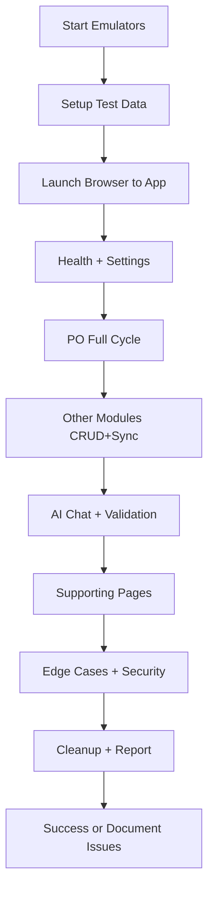

# ATD QBO Platform - Final Test Plan

**Status:** Draft - Awaiting user confirmation on scope (see clarifying question in Architect response)

**Objective:** Validate the full platform (all implemented modules) works end-to-end, address critical gaps from FINALIZATION_AUDIT, and prepare for production use.

## Success Criteria
- All core user journeys complete successfully without crashes or unhandled errors.
- QBO sync works for create/approve flows (PO + other modules).
- AI features (chat + per-module validation) respond appropriately.
- Health check page shows all services green.
- Browser console clean; user feedback via Toasts.
- Test data created, processed, and cleaned up.
- Critical audit items documented or mitigated (auth, rules, hardcodes).

## Test Scope
- **Modules:** Purchase Orders, Invoices, Bills, Payments, Expenses, AI Chat, Vendor Management, Settings, Dashboard, Help, Health.
- **Types:** Manual smoke + Automated E2E (Playwright via webapp-testing skill), security basics, integration (QBO, Sheets, Firestore).
- **Environments:** Primary - Firebase emulators; Secondary - Deployed Firebase project (if accessible).

## Prerequisites
- Emulators running (`npm run emulate` or scripts/start-emulators.sh).
- Test Google Sheet with sample rows (PO data).
- Configured QBO connection (sandbox preferred).
- Test vendors/items in QBO/Firestore.
- Firebase Auth enabled (even if minimal for internal tool).

## Test Data Setup
1. Create test vendors in QBO and sync via Vendor Management.
2. Populate sample Google Sheet with PO/Invoice data.
3. Configure Settings (sheet IDs, account mappings - avoid hardcodes).
4. Clear cache/logs from prior tests.

## Core Test Cases (Logical Order)

1. **Platform Health & Setup**
   - Load HealthCheck page - all services green.
   - Verify Settings load/save (modules enabled, sheet IDs).
   - Check QBO connection status.

2. **Purchase Order Full Cycle (Primary Flow)**
   - Create PO from web form (multi-line).
   - Review/approve draft.
   - Verify in History + QBO.
   - Import from Google Sheet.
   - AI validation on submit.

3. **Other Document Modules**
   - Repeat similar CRUD + approve + sync for Invoices, Bills, Payments, Expenses.
   - Verify cross-references (e.g. payments against bills).

4. **AI Features**
   - Use AI Chat page with domain-specific queries.
   - Trigger per-module AI (e.g. expense categorization, PO suggestions).
   - Validate responses, error handling, rate limits.

5. **Supporting Features**
   - Vendor Management (add/edit/sync).
   - Dashboard (stats, recent activity).
   - Help page content accuracy.
   - Toast notifications, loading states, toggles.

6. **Edge Cases & Security Smoke**
   - Invalid data submission (form validation).
   - Network interruption simulation.
   - Check for exposed endpoints (if auth added).
   - Firestore rules basic test (if tightened).
   - Error paths and logging.

7. **Cleanup & Reporting**
   - Delete test documents/sheets entries.
   - Capture screenshots/logs for each major flow.
   - Generate summary report of passes/failures.

## Automated Testing Approach
Use Playwright via `scripts/with_server.py` + custom scripts in `frontend/e2e/` or root.
- Follow webapp-testing SKILL.md patterns (networkidle waits, screenshots, console log capture).
- Target: At minimum 1 script per major flow; full suite if time allows.
- Existing tests (api.test.js, helpers.test.js) to be expanded where relevant.

## Post-Test Actions
- Fix high-priority items from FINALIZATION_AUDIT (auth middleware, rules, favicon, proxy, em-dashes, version consistency).
- Update README, docs, CLAUDE.md with current status.
- Archive old review docs if no longer needed.
- If tests pass, mark platform as "production-ready for internal use".

## Risks/Notes
- No real auth currently - tests assume open access.
- QBO production keys needed for live sync tests.
- Large page files may impact test selector stability (consider component extraction later).

This plan is actionable for test-engineer or code mode. Update todo list as tests execute and issues are found.

**Mermaid Test Workflow** (repeated for reference):

