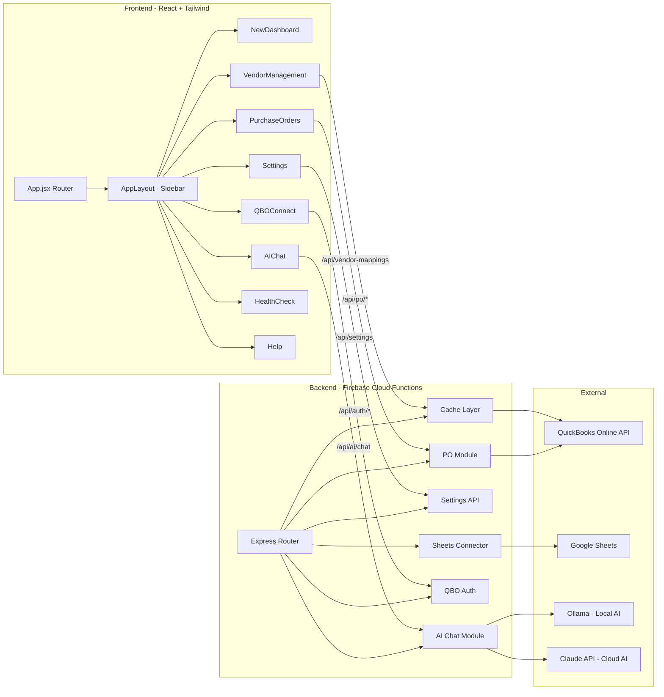
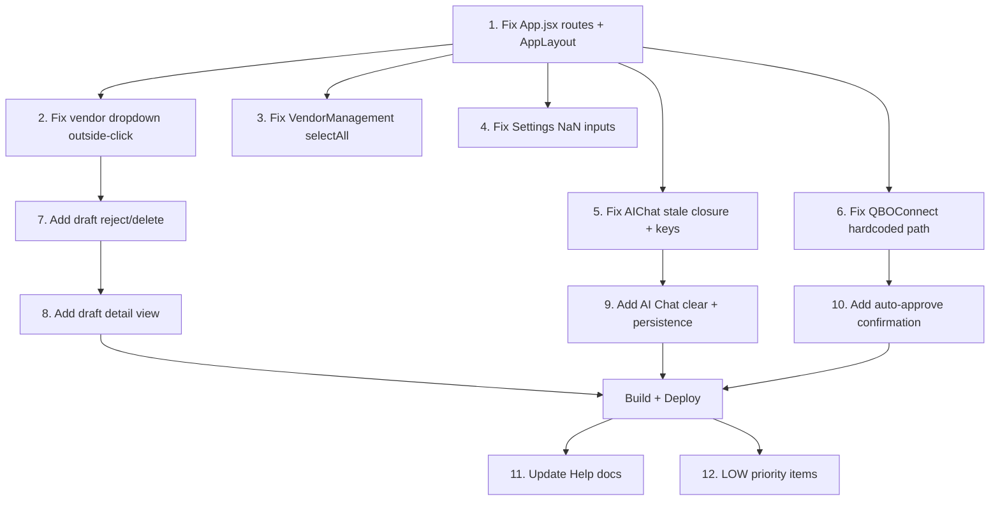

# Phase 1 Completion Plan — ATD QBO Platform

**Date:** 2026-04-07  
**Status:** ✅ COMPLETED — Deployed 2026-04-08  
**Deployment:** https://atd-qbo-platform.web.app  
**Goal:** Get the platform into a working, deployable state with all existing pages accessible and critical bugs resolved.

---

## Current State Summary

The platform has a solid foundation: a React+Tailwind frontend, Express-based Firebase Cloud Functions backend, Firestore for data, QBO API integration, and a Google Sheets import flow. However, several critical issues prevent the app from being used.

### What's Already Working
- Backend API routes are comprehensive (PO CRUD, items, vendors, sheets, auth, health, settings, AI chat)
- QBO item pagination implemented via `fetchAllFromQbo` in [`cache.js`](../functions/core/cache.js:78)
- Draft approval logic reads from document root correctly in [`purchase-order/index.js`](../functions/modules/purchase-order/index.js:392)
- NonInventory item creation includes `ExpenseAccountRef` in [`routes.js`](../functions/api/routes.js:185)
- Vendor sync uses `refreshVendors` for forced refresh in [`routes.js`](../functions/api/routes.js:586)
- Frontend/backend `DEFAULT_SETTINGS` are synchronized
- Health endpoint uses lightweight key check (no real Claude API calls)
- Sheet preview and import count response shapes are aligned
- Lazy loading, ErrorBoundary, and catch-all route added to [`App.jsx`](../frontend/src/App.jsx:1)
- XSS fix in AI Chat, accessibility improvements in Toggle and InfoTooltip

---

## Architecture Overview

---

## Issues by Priority

### CRITICAL — App is Broken Without This

#### 1. App.jsx Missing Routes and Sidebar Navigation

**Problem:** [`App.jsx`](../frontend/src/App.jsx:60) uses [`SimpleLayout`](../frontend/src/components/shared/SimpleLayout.jsx:7) which only renders a header bar with NO sidebar. Only 4 of 8 pages are routed.

**Missing routes:**
| Path | Page Component | Status |
|------|---------------|--------|
| `/purchase-orders` | `PurchaseOrders` | Missing from router |
| `/settings` | `Settings` | Missing from router |
| `/qbo-connect` | `QBOConnect` | Missing from router |
| `/vendor-management` | `VendorManagement` | Missing from router |

**The sidebar** is defined in [`AppLayout.jsx`](../frontend/src/components/shared/AppLayout.jsx:21) and links to all 8 pages, but `AppLayout` is never used.

**Fix:**
- Replace `SimpleLayout` with `AppLayout` in `App.jsx`
- Add lazy imports for `PurchaseOrders`, `Settings`, `QBOConnect`, `VendorManagement`
- Add `<Route>` entries for all 4 missing paths

---

### HIGH — Fix Before Production Use

#### 2. Vendor Dropdown Outside-Click

[`PurchaseOrders.jsx`](../frontend/src/pages/PurchaseOrders.jsx:596) vendor select dropdown does not close when clicking outside. The `SearchableItemDropdown` component has a proper `mousedown` listener pattern, but the vendor dropdown section lacks it.

**Fix:** Add `useRef` + `useEffect` with `mousedown` listener to the vendor dropdown, matching the `SearchableItemDropdown` pattern.

#### 3. VendorManagement Select All Bug

[`VendorManagement.jsx`](../frontend/src/pages/VendorManagement.jsx:93) `selectAll()` maps over `vendors` (full list) instead of `filtered` (search-filtered subset).

**Fix:** Change `selectAll` to operate on the filtered vendor list.

#### 4. Settings NaN for Number Inputs

[`Settings.jsx`](../frontend/src/pages/Settings.jsx:370) `parseInt` on empty string produces `NaN` that gets saved to Firestore.

**Fix:** Guard with `|| 0` or restore previous value when parsing fails.

#### 5. AIChat Stale Closure

[`AIChat.jsx`](../frontend/src/pages/AIChat.jsx:131) `useCallback` for `sendMessage` depends on `[input, isLoading]` but accesses `input` directly.

**Fix:** Either add all referenced state to the dependency array or use a ref for input value.

#### 6. QBOConnect Hardcoded Path

[`QBOConnect.jsx`](../frontend/src/pages/QBOConnect.jsx:153) uses `href="/api/auth/connect"` which ignores `VITE_API_BASE_URL`.

**Fix:** Use the API base URL from environment variable.

---

### MEDIUM — Should Add for Usability

#### 7. Draft Reject/Delete
Add backend `DELETE /po/drafts/:draftId` route and enable the Reject button in `DraftsTab`.

#### 8. Draft Detail View
Add expandable row in `DraftsTab` to show line items before approving.

#### 9. Auto-Approve Confirmation
Show a modal/dialog when user toggles auto-approve and submits, warning this pushes directly to QBO.

#### 10. AI Chat UX
Add clear chat button and basic session persistence via `sessionStorage`.

#### 11. Help Docs Updates
Fix button label mismatch and stat card name references. Add Vendor Management documentation.

#### 12. AIChat React Keys
Replace array index keys with unique message IDs.

---

### LOW — Nice to Have

#### 13. Token Expiry Countdown
Show relative time countdown on QBO Connect page.

#### 14. Unsaved Changes Warning
Add `beforeunload` handler and visual dirty indicator in Vendor Management and Settings.

#### 15. Pagination Controls
Add page navigation for PO History (currently capped at 100) and Drafts (capped at 50).

#### 16. Markdown Rendering
Render AI responses with proper markdown formatting instead of `whitespace-pre-wrap`.

---

## Implementation Order

---

## Files to Modify

| File | Changes |
|------|---------|
| [`frontend/src/App.jsx`](../frontend/src/App.jsx) | Replace SimpleLayout with AppLayout, add 4 missing routes with lazy loading |
| [`frontend/src/pages/PurchaseOrders.jsx`](../frontend/src/pages/PurchaseOrders.jsx) | Fix vendor dropdown outside-click, add draft detail view, add auto-approve confirm |
| [`frontend/src/pages/VendorManagement.jsx`](../frontend/src/pages/VendorManagement.jsx) | Fix selectAll to use filtered list |
| [`frontend/src/pages/Settings.jsx`](../frontend/src/pages/Settings.jsx) | Guard number input parsing |
| [`frontend/src/pages/AIChat.jsx`](../frontend/src/pages/AIChat.jsx) | Fix stale closure, add unique keys, add clear button, session persistence |
| [`frontend/src/pages/QBOConnect.jsx`](../frontend/src/pages/QBOConnect.jsx) | Use API base URL for connect link |
| [`frontend/src/pages/Help.jsx`](../frontend/src/pages/Help.jsx) | Fix label mismatches, add vendor docs |
| [`functions/api/routes.js`](../functions/api/routes.js) | Add DELETE /po/drafts/:draftId endpoint |
