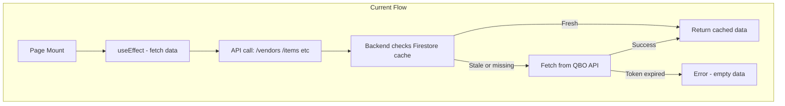
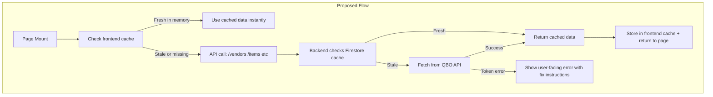
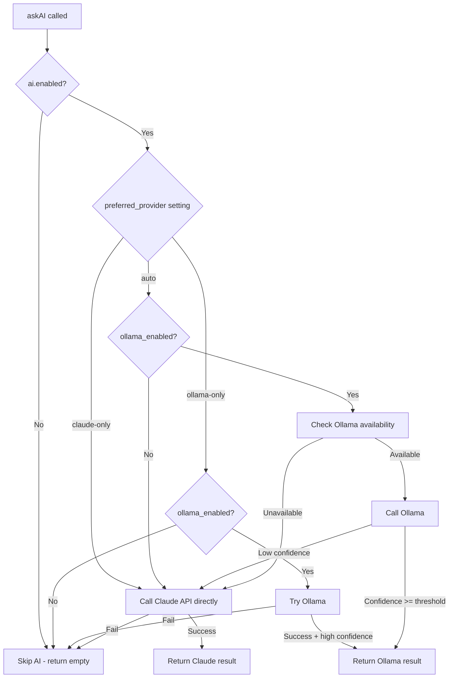

# Fix Data Loading Issues & Add AI Provider Toggle

## Problems Identified

### 1. Empty Vendors on VendorManagement Page
- `VendorManagement.jsx` calls `GET /vendor-mappings` which reads from a Firestore doc (`settings/vendor_mappings`)
- If no one has ever clicked "Sync from QuickBooks", this doc does not exist, so the page shows "No vendors synced yet"
- The PurchaseOrders page also calls `GET /vendors` (QBO cache) and `GET /vendor-mappings` (Firestore mappings)
- If QBO token is expired, `getCachedVendors()` fails and returns no data

### 2. Missing Product/Item List
- `GET /items` calls `getCachedItems()` which checks Firestore cache with 24h TTL
- If cache is stale, it hits QBO API. If token is expired, it silently returns `[]`
- User sees empty item dropdown with no explanation why

### 3. Unnecessary Data Fetching on Every Page Visit
- Every page has `useEffect(() => { loadData() }, [])` which fires on mount
- Navigating between pages causes redundant API calls (vendor list, item list, etc.)
- Backend Firestore cache has 24h TTL which helps, but even Firestore reads are wasteful when data hasn't changed
- **No frontend-level caching exists**

### 4. No Ollama On/Off Toggle
- The `ai-router.js` always checks Ollama availability (3-second timeout) before falling back to Claude
- No setting exists to disable Ollama specifically (only `ai.enabled` which disables ALL AI)
- User wants to switch Ollama on/off without disabling Claude fallback

---

## Architecture: Current vs. Proposed Data Flow

## Architecture: Proposed AI Provider Routing

---

## Implementation Plan

### Phase A: Frontend Data Cache Layer

**New file: `frontend/src/utils/dataCache.js`**

Create a simple in-memory cache with TTL that persists across page navigations within the same session:

- `getCached(key)` - returns data if fresh, null if stale/missing
- `setCache(key, data, ttlMs)` - stores data with timestamp
- `invalidate(key)` - clears a specific key
- `invalidateAll()` - clears everything
- Default TTL: 5 minutes for frontend cache (backend has its own 24h cache)

**Update all pages that fetch shared data** (PurchaseOrders, Invoices, Bills, Payments, Expenses):
- Check frontend cache first
- Only call API if cache is stale
- Add a refresh/sync button for manual cache invalidation

### Phase B: Fix Vendor + Item Loading

**VendorManagement.jsx:**
- On initial load, if vendor mappings are empty, check if QBO is connected
- If connected, show a prompt: "Vendors have not been synced yet. Would you like to sync now?" with a prominent button
- If not connected, show: "Connect to QuickBooks first to sync vendors"

**Error handling for /vendors and /items:**
- When API returns error, show a clear message with resolution steps
- Common errors: "QBO token expired - go to QBO Connect to refresh" instead of empty data

### Phase C: AI Provider Toggle

**Backend (`functions/core/settings.js`):**
- Add `ai.ollama_enabled: true` (boolean to enable/disable Ollama specifically)
- Add `ai.preferred_provider: 'auto'` (options: 'auto', 'ollama-only', 'claude-only')

**Backend (`functions/core/ai-router.js`):**
- Read `ollama_enabled` and `preferred_provider` from settings
- If `preferred_provider === 'claude-only'`, skip Ollama entirely
- If `preferred_provider === 'ollama-only'`, only use Ollama (no Claude fallback)
- If `preferred_provider === 'auto'` (default), use current logic but respect `ollama_enabled`
- If `ollama_enabled === false`, skip the 3-second availability check

**Frontend (`frontend/src/pages/Settings.jsx`):**
- Add "Ollama Enabled" toggle in the AI Configuration section
- Add "Preferred AI Provider" dropdown: Auto, Ollama Only, Claude Only
- Save both settings to Firestore via existing settings API

### Phase D: UI Polish

**Dashboard AI provider status:**
- Show which AI provider is currently active based on settings
- Show "Ollama: Disabled" or "Ollama: Enabled" based on toggle

---

## Files to Modify

| File | Changes |
|------|---------|
| `frontend/src/utils/dataCache.js` | **NEW** - Frontend in-memory cache utility |
| `frontend/src/pages/PurchaseOrders.jsx` | Use dataCache for vendors/items, add refresh button |
| `frontend/src/pages/Invoices.jsx` | Use dataCache for customers/items |
| `frontend/src/pages/Bills.jsx` | Use dataCache for vendors/items/accounts |
| `frontend/src/pages/Payments.jsx` | Use dataCache for customers |
| `frontend/src/pages/Expenses.jsx` | Use dataCache for accounts |
| `frontend/src/pages/VendorManagement.jsx` | Auto-sync prompt when empty, better error UX |
| `frontend/src/pages/Settings.jsx` | Add Ollama toggle + preferred provider dropdown |
| `frontend/src/pages/NewDashboard.jsx` | Show AI provider status |
| `functions/core/settings.js` | Add `ollama_enabled` and `preferred_provider` to defaults |
| `functions/core/ai-router.js` | Respect new AI provider settings |
| `functions/api/routes.js` | Better error responses for /vendors and /items with fix instructions |
