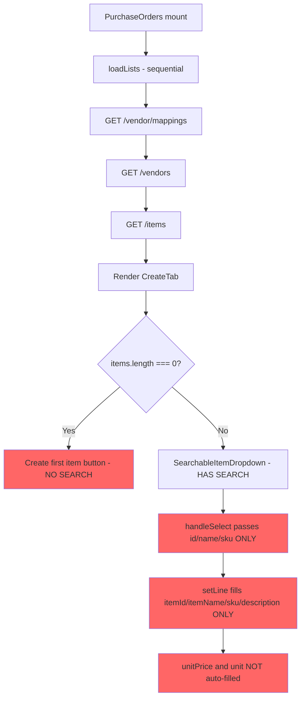
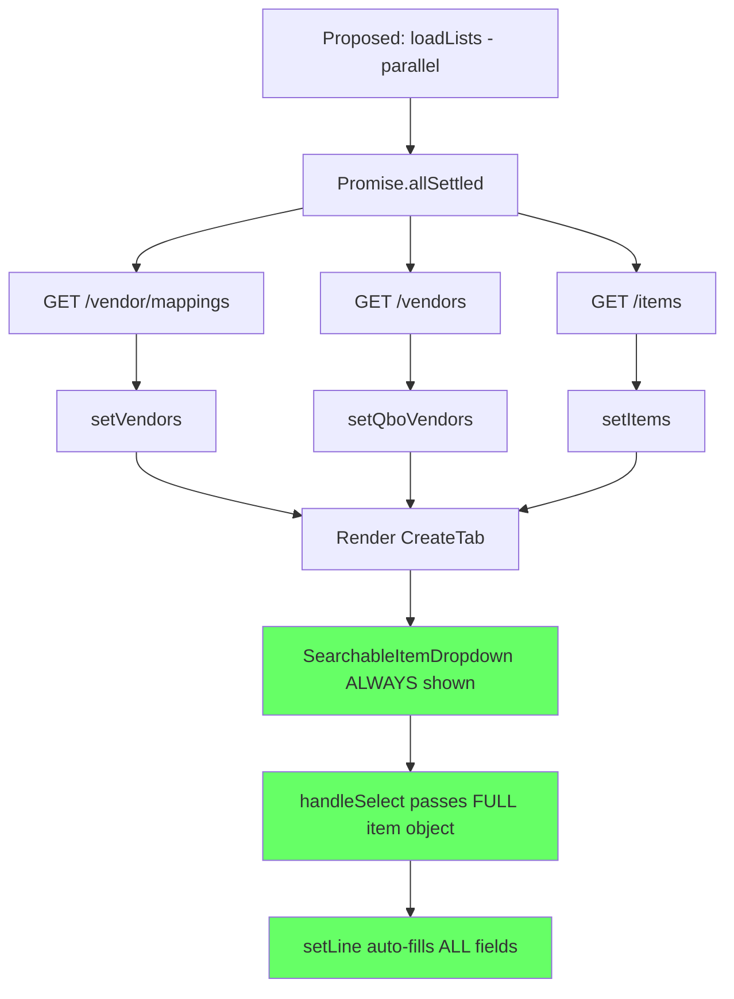

# Fix Plan: PO Item Search & Vendor Loading

## Root Cause Analysis

### Problem 1: Cannot search/select existing items
- **Root cause**: [`PurchaseOrders.jsx:986-1002`](frontend/src/pages/PurchaseOrders.jsx:986) — when `items.length === 0`, the UI replaces `SearchableItemDropdown` with a "Create first item" button. If items fail to load or haven't loaded yet, users are forced into "create new" with no way to search existing items.
- **Secondary cause**: No loading state for items — the dropdown immediately shows "Create first item" while items are still being fetched.

### Problem 2: "Loading vendors..." indefinitely
- **Root cause**: [`PurchaseOrders.jsx:1916-1958`](frontend/src/pages/PurchaseOrders.jsx:1916) — `loadLists()` makes 3 sequential API calls: vendor mappings → QBO vendors → items. If the first call is slow or fails, all subsequent calls are blocked.
- **Secondary cause**: [`dataCache.js:8`](frontend/src/utils/dataCache.js:8) — 5-minute TTL means cache expires frequently, forcing re-fetches.
- **Tertiary cause**: [`cache-routes.js:52-68`](functions/api/cache-routes.js:52) — `GET /vendors` calls `ensureValidToken()` which can hang if QBO auth is stale.

### Problem 3: No auto-fill when selecting existing item
- **Root cause**: [`PurchaseOrders.jsx:213-214`](frontend/src/pages/PurchaseOrders.jsx:213) — `SearchableItemDropdown.handleSelect()` only passes `{ id, name, sku }` — it does NOT pass `UnitPrice`, `Description`, `PurchaseCost`, or unit info.
- **Secondary cause**: [`PurchaseOrders.jsx:669-678`](frontend/src/pages/PurchaseOrders.jsx:669) — `setLine()` for `key === 'item'` only fills `itemId`, `itemName`, `sku`, `description` — does NOT fill `unitPrice` or `unit`.

### Problem 4: No vendor-linked item filtering
- **Root cause**: `SearchableItemDropdown` has no `vendorId` prop — it cannot filter/prioritize items linked to the selected vendor.

---

## Data Flow Diagram





---

## Fix Plan

### Group A: Fix Vendor Loading — PARALLELIZABLE with Group B

#### A1. Parallelize API calls in `loadLists`
- **File**: [`frontend/src/pages/PurchaseOrders.jsx:1916-1958`](frontend/src/pages/PurchaseOrders.jsx:1916)
- **Change**: Replace sequential `await` calls with `Promise.allSettled` so vendors, QBO vendors, and items load independently
- **AC**: Each data type loads and renders as soon as its own call completes, even if others fail

#### A2. Add per-data-type loading states
- **File**: [`frontend/src/pages/PurchaseOrders.jsx:1897-1900`](frontend/src/pages/PurchaseOrders.jsx:1897)
- **Change**: Replace single `vendorsLoading` with `vendorsLoading`, `itemsLoading`, and `qboVendorsLoading` states
- **AC**: Vendor dropdown shows "Loading vendors..." only while vendors load; items dropdown shows its own loading state independently

#### A3. Show vendor error state with retry
- **File**: [`frontend/src/pages/PurchaseOrders.jsx:806-875`](frontend/src/pages/PurchaseOrders.jsx:806)
- **Change**: Add error state for vendor loading failure with a "Retry" button alongside the existing QBO connection link
- **AC**: If vendor fetch fails, user sees an error message with retry option instead of permanent "Loading vendors..."

#### A4. Increase localStorage cache TTL for vendor mappings and items
- **File**: [`frontend/src/utils/dataCache.js:8`](frontend/src/utils/dataCache.js:8)
- **Change**: Increase `DEFAULT_TTL_MS` from 5 minutes to 30 minutes, or add per-key TTL support so vendor mappings and items cache longer
- **AC**: Less frequent re-fetches; data loads from cache on revisits within 30 minutes

#### A5. Use `/vendor/mappings/active` endpoint for vendor dropdown
- **File**: [`frontend/src/pages/PurchaseOrders.jsx:1920-1931`](frontend/src/pages/PurchaseOrders.jsx:1920)
- **Change**: Replace `api.getVendorMappings()` with a new `api.getActiveVendors()` call that hits `GET /vendor/mappings/active` — this endpoint already exists in [`vendor-routes.js:195-214`](functions/api/vendor-routes.js:195) and returns only active/visible vendors, avoiding client-side filtering
- **Add**: `getActiveVendors: () => api.get('/vendor/mappings/active')` to [`api.js`](frontend/src/utils/api.js:79)
- **AC**: Vendor dropdown fetches only active vendors, reducing payload size and eliminating client-side filter logic

---

### Group B: Fix Item Search & Auto-fill — PARALLELIZABLE with Group A

#### B1. Always show `SearchableItemDropdown`, never "Create first item" button
- **File**: [`frontend/src/pages/PurchaseOrders.jsx:986-1002`](frontend/src/pages/PurchaseOrders.jsx:986)
- **Change**: Remove the conditional that shows "Create first item" when `items.length === 0`. Instead, always render `SearchableItemDropdown`. When items are loading, show a spinner/placeholder inside the dropdown. When items are empty after loading, show "No items available — create one?" with a link to the create modal.
- **AC**: Users always see the search input; they can search existing items as the primary action

#### B2. Pass full item data from `SearchableItemDropdown.handleSelect`
- **File**: [`frontend/src/pages/PurchaseOrders.jsx:213-218`](frontend/src/pages/PurchaseOrders.jsx:213)
- **Change**: `handleSelect` should pass the full item object: `onChange({ id: item.Id, name: item.Name, sku: item.Sku || '', description: item.Description || '', unitPrice: item.UnitPrice || item.PurchaseCost || '', unit: item.Unit || '' })`
- **AC**: Selecting an item passes all available fields to the parent

#### B3. Auto-fill all line item fields when an existing item is selected
- **File**: [`frontend/src/pages/PurchaseOrders.jsx:669-678`](frontend/src/pages/PurchaseOrders.jsx:669)
- **Change**: When `key === 'item'`, also fill `unitPrice` from `val.unitPrice` and `description` from `val.description` (falling back to `val.name`), and `unit` from `val.unit` if available
- **AC**: Selecting an existing item auto-fills SKU, description, unit price, and unit

#### B4. Add vendor-linked item filtering to `SearchableItemDropdown`
- **File**: [`frontend/src/pages/PurchaseOrders.jsx:124-295`](frontend/src/pages/PurchaseOrders.jsx:124)
- **Change**: Add `vendorId` prop to `SearchableItemDropdown`. When provided, items whose `PreferredVendorRef.value` matches the vendor ID are sorted to the top of results. Add a "Vendor items first" toggle or always prioritize vendor-linked items.
- **File**: [`frontend/src/pages/PurchaseOrders.jsx:996-1001`](frontend/src/pages/PurchaseOrders.jsx:996) — pass `vendorId={form.vendorId}` to `SearchableItemDropdown`
- **AC**: When a vendor is selected, items linked to that vendor appear first in search results

#### B5. Add loading/empty states inside `SearchableItemDropdown`
- **File**: [`frontend/src/pages/PurchaseOrders.jsx:124-295`](frontend/src/pages/PurchaseOrders.jsx:124)
- **Change**: Add `loading` prop. When `loading=true`, show a spinner with "Loading items..." inside the dropdown. When `loading=false` and `items.length === 0`, show "No items found. Create a new item?" with a clickable link that triggers `onCreateNew`.
- **AC**: Users see appropriate feedback during loading and when no items exist

---

### Group C: Backend Improvements — PARALLELIZABLE with A and B

#### C1. Add `api.getActiveVendors` helper
- **File**: [`frontend/src/utils/api.js`](frontend/src/utils/api.js:79)
- **Change**: Add `getActiveVendors: () => api.get('/vendor/mappings/active')` after `getVendorMappings`
- **AC**: Frontend can call the active vendors endpoint directly

#### C2. Ensure `/vendor/mappings/active` handles QBO-not-connected gracefully
- **File**: [`functions/api/vendor-routes.js:195-214`](functions/api/vendor-routes.js:195)
- **Change**: Add try/catch with graceful fallback — if Firestore read fails, return empty vendors array with `success: true` instead of erroring
- **AC**: Even if Firestore is unavailable, the endpoint returns an empty list rather than hanging or erroring

#### C3. Add `/items/search` endpoint for server-side item search (optional, future)
- **File**: New route in [`functions/api/cache-routes.js`](functions/api/cache-routes.js:71)
- **Change**: Add `GET /items/search?q=keyword&vendorId=xxx` that searches cached items server-side with fuzzy matching. This is optional for now since client-side search works for reasonable item counts.
- **AC**: For future scalability, large item catalogs can be searched server-side

---

## Implementation Order

```
Phase 1 (Critical fixes — do first):
  A1. Parallelize loadLists
  A2. Per-data-type loading states
  B1. Always show SearchableItemDropdown
  B2. Pass full item data from handleSelect
  B3. Auto-fill all line item fields

Phase 2 (UX improvements — parallelizable):
  A3. Vendor error state with retry
  A4. Increase cache TTL
  A5. Use /vendor/mappings/active endpoint
  B4. Vendor-linked item filtering
  B5. Loading/empty states in SearchableItemDropdown

Phase 3 (Backend hardening — parallelizable):
  C1. Add api.getActiveVendors helper
  C2. Graceful error handling in /vendor/mappings/active
  C3. (Optional) Server-side item search endpoint
```

## Files to Modify

| File | Changes |
|------|---------|
| [`frontend/src/pages/PurchaseOrders.jsx`](frontend/src/pages/PurchaseOrders.jsx) | A1, A2, A3, B1, B2, B3, B4, B5 — parallelize loadLists, per-type loading, always show dropdown, pass full item, auto-fill fields, vendor filtering, loading states |
| [`frontend/src/utils/dataCache.js`](frontend/src/utils/dataCache.js) | A4 — increase TTL or add per-key TTL |
| [`frontend/src/utils/api.js`](frontend/src/utils/api.js) | C1 — add `getActiveVendors` helper |
| [`functions/api/vendor-routes.js`](functions/api/vendor-routes.js) | C2 — graceful error handling in `/mappings/active` |

## Acceptance Criteria Summary

1. **Item search always available**: `SearchableItemDropdown` is always rendered, never replaced by "Create first item" button
2. **Vendor dropdown loads reliably**: No permanent "Loading vendors..." — shows error with retry if fetch fails
3. **Parallel data loading**: Vendors, QBO vendors, and items load independently
4. **Auto-fill on item selection**: Selecting an existing item fills SKU, description, unit price, and unit
5. **Vendor-linked item prioritization**: Items linked to the selected vendor appear first in search
6. **Create new is secondary**: "Create new item" appears as an option within the dropdown, not as the primary action
7. **Cache TTL extended**: Less frequent re-fetches reduce "Loading..." states