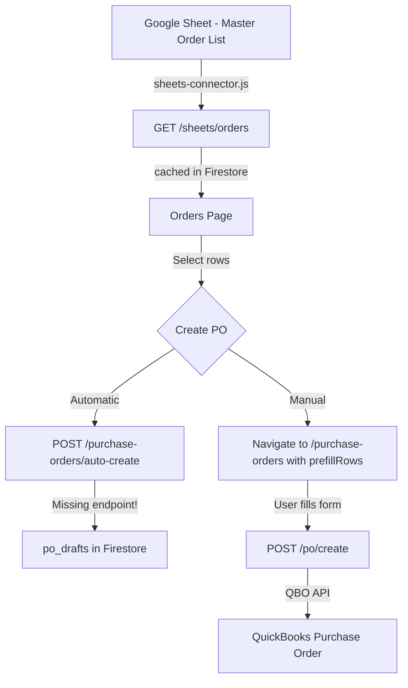

# Google Sheets Connection + Settings Fix Plan

## Current State Summary

- **Google Sheets backend**: `sheets-connector.js` (read-only), `sheets-routes.js` (4 endpoints: test-connection, preview, orders, import)
- **Orders page**: Fetches from `/sheets/orders`, displays table, has "Create PO" dropdown (Manual/Automatic)
- **Purchase Orders page**: Full PO form with vendor/item dropdowns
- **Settings page**: 5 sections + Danger Zone
- **Missing**: `/purchase-orders/auto-create` endpoint (Orders page calls it but it doesn't exist)
- **Firebase project**: `atd-qbo-platform`, deployed via `firebase deploy`

---

## Architecture Flow

---

## Phase 1: Test & Fix Google Sheets Connection

### 1.1 Verify service account credentials
- **File**: `functions/.env` — ensure `GOOGLE_APPLICATION_CREDENTIALS` is set or ADC works on Cloud Functions
- **Action**: Check if the service account has access to the configured sheet ID
- **Acceptance**: `GET /sheets/test-connection` returns `{ success: true }`

### 1.2 Fix test-connection response handling in frontend
- **File**: `frontend/src/pages/Settings.jsx` (line ~381-389)
- **Issue**: `handleTestSheetConnection` calls `api.testSheetConnection()` but the backend returns `{ success: true }` on 200 or `{ success: false }` on 502 — the frontend only catches thrown errors, not the `success: false` case
- **Fix**: Check `result.success` in the response and show appropriate status
- **Acceptance**: Test Connection button shows green check on success, red X on failure with meaningful message

### 1.3 Add auto-sync interval for sheets data
- **File**: `frontend/src/pages/Orders.jsx`
- **Issue**: Data only loads on page mount or manual refresh — no auto-pull
- **Fix**: Add a `setInterval` (e.g., every 5 minutes matching `CACHE_TTL_MS`) that calls `loadData()` silently
- **Acceptance**: Orders page auto-refreshes data without user action

---

## Phase 2: Verify Orders Page Data Pull

### 2.1 Test end-to-end: Sheet → API → Orders page
- **Action**: Deploy functions, open Orders page, verify rows appear
- **Acceptance**: Orders page shows real data from the configured Google Sheet

### 2.2 Fix transpose logic if sheet is column-oriented
- **File**: `functions/api/sheets-routes.js` (line ~18-39, `transposeSheetData`)
- **Issue**: The `/sheets/orders` endpoint calls `transposeSheetData` but `/sheets/preview` does not — inconsistent
- **Fix**: Ensure both endpoints handle row-oriented and column-oriented sheets consistently
- **Acceptance**: Both preview and orders show correctly parsed data regardless of sheet orientation

---

## Phase 3: Fix Orders → Create PO Flow

### 3.1 Add `/purchase-orders/auto-create` endpoint
- **File**: `functions/api/po-routes.js`
- **Issue**: Orders page calls `api.post('/purchase-orders/auto-create', ...)` but this route doesn't exist
- **Fix**: Add `POST /purchase-orders/auto-create` that:
  1. Accepts `{ rows, headers }` from the Orders page
  2. Groups rows by order number
  3. Creates PO drafts in Firestore `po_drafts` collection
  4. Returns `{ created: number, draftIds: string[] }`
- **Acceptance**: Selecting orders and clicking "Automatic" creates PO drafts

### 3.2 Fix Manual PO creation prefill from Orders
- **File**: `frontend/src/pages/PurchaseOrders.jsx`
- **Issue**: Orders page navigates with `state: { prefillRows, headers }` but PurchaseOrders may not handle this state
- **Fix**: In PurchaseOrders, read `location.state?.prefillRows` and `location.state?.headers` on mount, auto-populate PO form fields (vendor, items, quantities)
- **Acceptance**: Selecting orders → Manual → PO form pre-filled with order data

### 3.3 Add single-row "Create PO" action on Orders page
- **File**: `frontend/src/pages/Orders.jsx`
- **Issue**: Currently requires selecting rows with checkboxes then using bulk action — no per-row quick action
- **Fix**: Add a "Create PO" button/icon in each expanded row's FulfillmentPanel or as a row action
- **Acceptance**: Can create a PO from a single order row without using the bulk select flow

---

## Phase 4: Fix Settings Page

### 4.1 Remove unnecessary settings
- **Remove from QBO section**:
  - "Last Refreshed" read-only field (line ~947-949) — not useful, token info is shown on QBO Connect page
  - "Token Expires At" read-only field (line ~950-952) — same reason
  - "Refresh Vendor Cache" button (line ~958-970) — belongs on Vendor Management page, not Settings
  - "Refresh Item Cache" button (line ~972-984) — belongs on Items page, not Settings
- **Remove from Google Sheets section**:
  - Production environment warning (line ~563-568) — this is a QBO concern, not Sheets

### 4.2 Add missing settings
- **Add to QBO section**:
  - `default_income_account` — dropdown populated from QBO accounts
  - `default_expense_account` — dropdown populated from QBO accounts  
  - `default_cogs_account` — dropdown populated from QBO accounts
  - `default_asset_account` — dropdown populated from QBO accounts
  - These exist in backend `DEFAULT_SETTINGS` but aren't in the frontend UI
- **Add to Google Sheets section**:
  - "Sync Now" button that triggers `/sheets/import` to pull orders immediately
  - Last sync timestamp display
  - Connection status indicator (green/red dot)

### 4.3 Fix Module Settings
- **File**: `frontend/src/pages/Settings.jsx` (line ~57-62, `MODULE_ROWS`)
- **Issue**: Invoice, Bill, Payment modules marked `available: false` but they have working backend routes
- **Fix**: Set `available: true` for invoice, bill, payment modules since they have functional backends
- **Acceptance**: All 4 modules can be toggled in Settings

### 4.4 Sync frontend BACKEND_DEFAULTS with backend DEFAULT_SETTINGS
- **File**: `frontend/src/pages/Settings.jsx` (line ~83-152)
- **Issue**: Frontend defaults have `invoice_sheet_id`, `invoice_sheet_tab`, `invoice_column_mapping` that backend doesn't have; frontend `oauth.redirect_uri` differs from backend
- **Fix**: Align both to match — remove invoice sheet config from frontend defaults (not supported yet), fix redirect_uri to match backend
- **Acceptance**: Frontend and backend defaults are identical

---

## Phase 5: Build, Deploy, Test

### 5.1 Build frontend
- **Command**: `cd frontend && npm run build`
- **Acceptance**: Build succeeds with no errors

### 5.2 Deploy to Firebase
- **Command**: `firebase deploy`
- **Acceptance**: Both functions and hosting deploy successfully

### 5.3 Visual & functional testing
- **Test matrix**:
  1. Settings page: Test Connection → green check
  2. Settings page: Save each section → "Settings saved" toast
  3. Orders page: Data loads from Google Sheets
  4. Orders page: Select rows → Create PO Manual → PO form pre-filled
  5. Orders page: Select rows → Create PO Automatic → PO drafts created
  6. Purchase Orders page: Create PO manually → submits to QBO
  7. Settings page: Module toggles all work
  8. Settings page: No unnecessary fields visible

### 5.4 Commit and push
- **Command**: `git add -A && git commit -m "feat: Google Sheets auto-pull, Orders→PO flow, Settings cleanup" && git push`
- **Acceptance**: Changes pushed to remote

---

## Phase 6: Iterate

- If any test from 5.3 fails, fix and repeat from 5.1
- Maximum 3 fix-deploy-test cycles before escalating

---

## Parallelizable Tasks

These can be done simultaneously:
- **Phase 1** (Sheets connection fix) ∥ **Phase 4** (Settings cleanup)
- **Phase 3.1** (auto-create endpoint) ∥ **Phase 3.2** (manual prefill fix)
