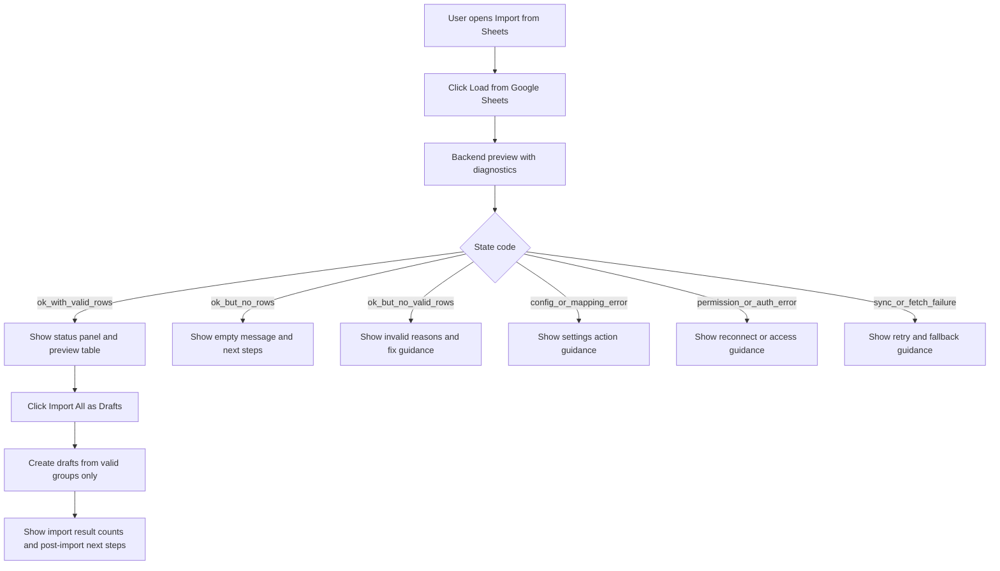

# Purchase Orders Import from Sheets Improvement Plan

1. Baseline flow audit in [`frontend/src/pages/PurchaseOrders.jsx`](../frontend/src/pages/PurchaseOrders.jsx) and [`functions/api/sheets-routes.js`](../functions/api/sheets-routes.js).  
   - Capture current load and import behavior in [`ImportFromSheetsTab`](../frontend/src/pages/PurchaseOrders.jsx).  
   - Identify missing helper text, ambiguous UI states, and hidden failure causes from [`/sheets/preview`](../functions/api/sheets-routes.js) and [`/sheets/import`](../functions/api/sheets-routes.js).  
   - **Acceptance criteria:** documented state matrix covering success, empty, invalid, config, permission, and fetch failures.

2. Define backend diagnostics contract in [`functions/api/sheets-routes.js`](../functions/api/sheets-routes.js) and [`functions/core/sheets-connector.js`](../functions/core/sheets-connector.js).  
   - Add deterministic state codes for: no sheet connected, wrong sheet or tab, connected but empty, no valid importable rows, mapping or config issue, permission or auth issue, sync or fetch failure.  
   - Return plain-English message and next-step guidance per state from [`router.get('/preview')`](../functions/api/sheets-routes.js).  
   - Include metadata: sheet id name if available, tab name, last checked time, total rows, valid rows, invalid rows with reason buckets.  
   - **Acceptance criteria:** API response schema supports all requested user-facing states without frontend guessing.

3. Refactor import validation and grouping in [`functions/core/sheets-connector.js`](../functions/core/sheets-connector.js).  
   - Validate importable row criteria before grouping by PO in [`groupByPO`](../functions/core/sheets-connector.js).  
   - Report invalid-row reasons such as missing order number, missing vendor, missing quantity, bad numeric fields.  
   - Ensure import endpoint only creates drafts from valid groups while reporting skipped reasons in [`router.post('/import')`](../functions/api/sheets-routes.js).  
   - **Acceptance criteria:** valid rows import successfully and invalid rows are clearly explained.

4. Update frontend API handling in [`frontend/src/utils/api.js`](../frontend/src/utils/api.js).  
   - Normalize sheets diagnostics and errors into stable shape consumed by [`ImportFromSheetsTab`](../frontend/src/pages/PurchaseOrders.jsx).  
   - Preserve backend message plus actionable hints for plain-English display.  
   - **Acceptance criteria:** UI receives consistent status payload for all preview and import outcomes.

5. Redesign Import from Sheets UX in [`frontend/src/pages/PurchaseOrders.jsx`](../frontend/src/pages/PurchaseOrders.jsx).  
   - Add clear helper text explaining [`handleLoadFromSheets`](../frontend/src/pages/PurchaseOrders.jsx) and [`handleImportAll`](../frontend/src/pages/PurchaseOrders.jsx).  
   - Add visible status panel with connected sheet, selected tab, last checked, total rows, valid rows ready to import.  
   - Add clear empty and error cards for each diagnostic code with plain-English next steps.  
   - Keep preview table and add summary so user knows exactly what will be imported.  
   - Gate Import button by valid rows and show what happens after import.  
   - **Acceptance criteria:** non-technical user can understand the workflow without external explanation.

6. Add and run tests for reliability and UX messaging in [`frontend/src/smoke.test.js`](../frontend/src/smoke.test.js) and backend route tests if available.  
   - Cover no data, invalid data, valid data, config error, auth or permission failure, tab mismatch.  
   - Verify import creates draft POs for valid groups and reports skips for invalid groups.  
   - **Acceptance criteria:** tests pass and assert state-specific guidance text.

7. QA and self-review pass across changed files.  
   - Verify no regressions in Create New, Pending Drafts, and History sections in [`frontend/src/pages/PurchaseOrders.jsx`](../frontend/src/pages/PurchaseOrders.jsx).  
   - Validate plain-English wording and exact next-step guidance for each failure state.  
   - **Acceptance criteria:** review checklist complete and all high-severity issues resolved.

8. Release and verification workflow after implementation.  
   - Commit and push branch to GitHub.  
   - Deploy frontend and backend to Firebase and Google Cloud.  
   - Live verify no data, invalid data, and valid data scenarios in production.  
   - Capture fresh screenshots in non-ignored directory such as [`plans/import-from-sheets-verification/`](./import-from-sheets-verification/).  
   - **Acceptance criteria:** screenshots prove clarity and correct behavior end-to-end.

## Parallelizable tasks

- Task 4 frontend API normalization in [`frontend/src/utils/api.js`](../frontend/src/utils/api.js).  
- Task 6 test additions in [`frontend/src/smoke.test.js`](../frontend/src/smoke.test.js) while backend diagnostics from task 2 are being finalized.

## Mermaid flow draft

