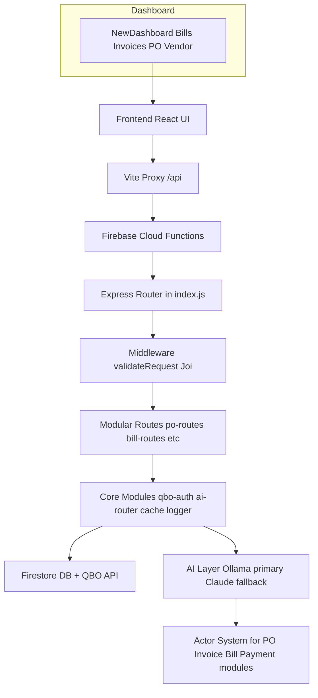

# Kilo Code Configuration Plan for ATD QBO Platform

**Project Adaptation from Traider Template**

The provided Traider configuration has been analyzed. This plan adapts it to the current ATD QBO Automation Platform (React frontend, Firebase Functions backend, QBO integration, AI routing to Ollama/Claude, modular accounting features).

## Adapted Architecture Mermaid Diagram

**Key Adaptations**
- Replace trading concepts (Signals, Adapters, Decision Engine, Playbooks) with accounting ones (Modules, Actor System, AI Prompts, QBO Entities).
- Critical Rules: Always use actor system, no in-memory state for cache, English comments only, async where applicable, proper error context.
- File locations updated to match current structure (functions/core, functions/modules, frontend/src/pages, etc).

## Current Todo List
- [x] Information gathering on current project and Traider config
- [x] Created this plan.md with Mermaid diagram for architecture
- [ ] Define CUSTOM INSTRUCTIONS FOR ALL MODES adapted for ATD QBO (tech stack, critical rules like actor system, QBO OAuth, AI routing)
- [ ] Create CODE MODE instructions (read files first, use existing patterns, update tests)
- [ ] Create ARCHITECT MODE instructions (modular modules, actor system compliance, specify files)
- [ ] Create TEST ENGINEER, REVIEW MODE instructions tailored to Firebase, React, QBO mocks
- [ ] Create GLOBAL RULES and WORKSPACE RULES files in Kilo Code settings
- [ ] Create 5 skills (qbo-module-builder, ai-prompt-builder, frontend-page-creator, test-writer, cache-optimizer)
- [ ] Create 4 workflows (implement-module, fix-actor-bypass, full-qa, review-ui)
- [ ] Update this todo list with any new discoveries from open files (e.g. FIX_REVIEW_RECOMMENDATIONS.md)
- [ ] Present final configuration text for user to paste into Kilo Code settings

Are you pleased with this plan? Should we adapt it further for specific priorities like completing the FIX_REVIEW_RECOMMENDATIONS or focusing on new modules (Invoices/Bills)? Any changes to the Mermaid or todo items?