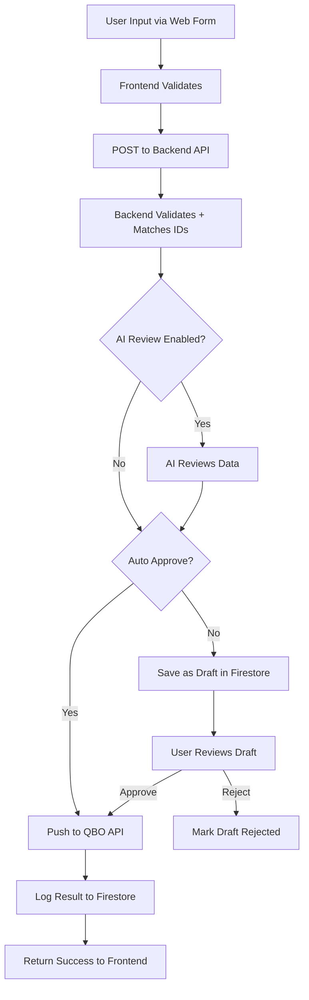

# Phase 2+ Full Platform Plan

## Scope
Implement all remaining features: 4 nice-to-haves + 4 new QBO modules. Each feature must work independently. If one module fails, it must not affect the rest of the app.

---

## Architecture Overview

Every new module follows the same pattern as Purchase Orders:



### File Structure for Each Module

```
functions/modules/{module-name}/
  index.js       - validate, buildPayload, pushToQBO, handleCreate, handleApproveDraft
  prompts.js     - AI review prompt templates

frontend/src/pages/{ModuleName}.jsx  - Full page with Create/Drafts/History tabs
```

### Isolation Strategy
- Each module has its own Firestore collections: `{module}_drafts`, logged under `module: '{module-name}'`
- Each module has its own API route prefix: `/invoice/*`, `/bill/*`, `/payment/*`, `/expense/*`
- Frontend pages are lazy-loaded: if one fails to load, ErrorBoundary catches it
- Backend routes are wrapped in try/catch: if one module throws, others continue working
- No shared mutable state between modules

---

## Part A: Nice-to-Have Improvements

### A1. Token Expiry Countdown on QBO Connect
- QBOConnect.jsx already has `getExpiryInfo()` that calculates time remaining
- Need to add a live countdown timer that updates every 60 seconds
- Show: "Token expires in 45m" with color coding (green > 30m, amber 5-30m, red < 5m)

### A2. Unsaved Changes Warning
- Add `useBeforeUnload` hook to VendorManagement.jsx and Settings.jsx
- Track `isDirty` state: set true when any field changes, false on save
- Show browser `beforeunload` confirmation when navigating away with unsaved changes
- Also intercept React Router navigation with `useBlocker`

### A3. Pagination for PO History and Drafts
- Add `page` and `pageSize` state to HistoryTab and DraftsTab
- Show "Showing 1-20 of 156" with Previous/Next buttons
- Backend already returns all results; paginate on frontend (data is small enough)

### A4. Markdown Rendering for AI Chat
- Install `react-markdown` package
- Wrap AI response messages in `<ReactMarkdown>` component
- Style code blocks, lists, bold text within chat bubbles

---

## Part B: New QBO Modules

### B1. Invoice Create Module

**QBO API**: `POST /v3/company/{realmId}/invoice`

**Required fields**:
- CustomerRef (value: customer ID)
- Line items with SalesItemLineDetail (ItemRef, Qty, UnitPrice)

**Firestore collections**: `invoice_drafts`

**Backend** (`functions/modules/invoice/index.js`):
- `validate(data, realmId)` - check customer, line items
- `buildPayload(data, matchedCustomer)` - build QBO Invoice JSON
- `pushToQBO(payload, realmId)` - POST to QBO
- `handleCreate(req, res)` - full flow: validate -> AI review -> draft/push
- `handleApproveDraft(req, res)` - approve draft -> push to QBO

**API Routes**:
- `POST /invoice/create` - create invoice
- `POST /invoice/approve/:draftId` - approve draft
- `GET /invoice/drafts` - list pending drafts
- `DELETE /invoice/drafts/:draftId` - reject draft
- `GET /invoice/history` - list invoice history

**Frontend** (`Invoices.jsx`):
- 3 tabs: Create New, Drafts, History
- Customer dropdown (from QBO customer cache)
- Line items table: Item, Description, Qty, Unit Price, Total
- AI Review toggle, Auto Approve toggle
- Same UX pattern as PurchaseOrders.jsx

**Cache addition**: Need `getCachedCustomers(realmId)` in cache.js

### B2. Bill Create Module

**QBO API**: `POST /v3/company/{realmId}/bill`

**Required fields**:
- VendorRef (value: vendor ID)
- Line items with ItemBasedExpenseLineDetail or AccountBasedExpenseLineDetail

**Firestore collections**: `bill_drafts`

**Backend** (`functions/modules/bill/index.js`):
- Same pattern as PO module but for Bills
- Bills are vendor invoices received by ATD (money going out)

**API Routes**:
- `POST /bill/create`
- `POST /bill/approve/:draftId`
- `GET /bill/drafts`
- `DELETE /bill/drafts/:draftId`
- `GET /bill/history`

**Frontend** (`Bills.jsx`):
- 3 tabs: Create New, Drafts, History
- Vendor dropdown (reuse existing vendor cache)
- Line items: Item, Description, Qty, Unit Price, Total
- Bill Number, Bill Date, Due Date, Memo

### B3. Payment Apply Module

**QBO API**: `POST /v3/company/{realmId}/payment`

**Required fields**:
- CustomerRef (value: customer ID)
- TotalAmt
- Line items linking to specific invoices

**Firestore collections**: `payment_drafts`

**Backend** (`functions/modules/payment/index.js`):
- `validate(data, realmId)` - check customer, amount, invoice references
- `buildPayload(data, matchedCustomer)` - build QBO Payment JSON
- `pushToQBO(payload, realmId)` - POST to QBO
- `handleCreate(req, res)` - full flow

**API Routes**:
- `POST /payment/create`
- `POST /payment/approve/:draftId`
- `GET /payment/drafts`
- `DELETE /payment/drafts/:draftId`
- `GET /payment/history`
- `GET /payment/open-invoices` - fetch unpaid invoices for a customer

**Frontend** (`Payments.jsx`):
- Customer dropdown
- Open invoices list (checkboxes to select which to pay)
- Payment amount, payment method, reference number
- 3 tabs: Apply Payment, Drafts, History

### B4. Expense Categorize Module

**QBO API**: `GET /v3/company/{realmId}/query?query=SELECT * FROM Purchase` (read expenses)

**Purpose**: AI-assisted categorization of uncategorized expenses

**Firestore collections**: `expense_reviews`

**Backend** (`functions/modules/expense/index.js`):
- `fetchUncategorized(realmId)` - query QBO for uncategorized purchases/expenses
- `aiCategorize(expense, accounts)` - AI suggests account category
- `applyCategory(expenseId, accountRef, realmId)` - update expense in QBO

**API Routes**:
- `GET /expense/uncategorized` - list uncategorized expenses
- `POST /expense/categorize` - apply AI-suggested category
- `GET /expense/history` - list categorization history

**Frontend** (`Expenses.jsx`):
- List of uncategorized expenses with AI-suggested categories
- Accept/Edit/Skip buttons per expense
- Bulk categorize option
- History of categorized expenses

---

## Implementation Order

1. Nice-to-haves first (small, isolated changes)
2. Invoice module (most similar to PO, good template)
3. Bill module (very similar to Invoice but vendor-side)
4. Payment module (links to invoices, slightly different)
5. Expense module (read-heavy, AI categorization focus)

Each module is deployed independently after completion.

---

## Sidebar Navigation Update

Current "Coming Soon" items in AppLayout.jsx will become active nav links:
- Invoices -> `/invoices`
- Bills -> `/bills`
- Payments -> `/payments`
- Expenses -> `/expenses` (new addition)
