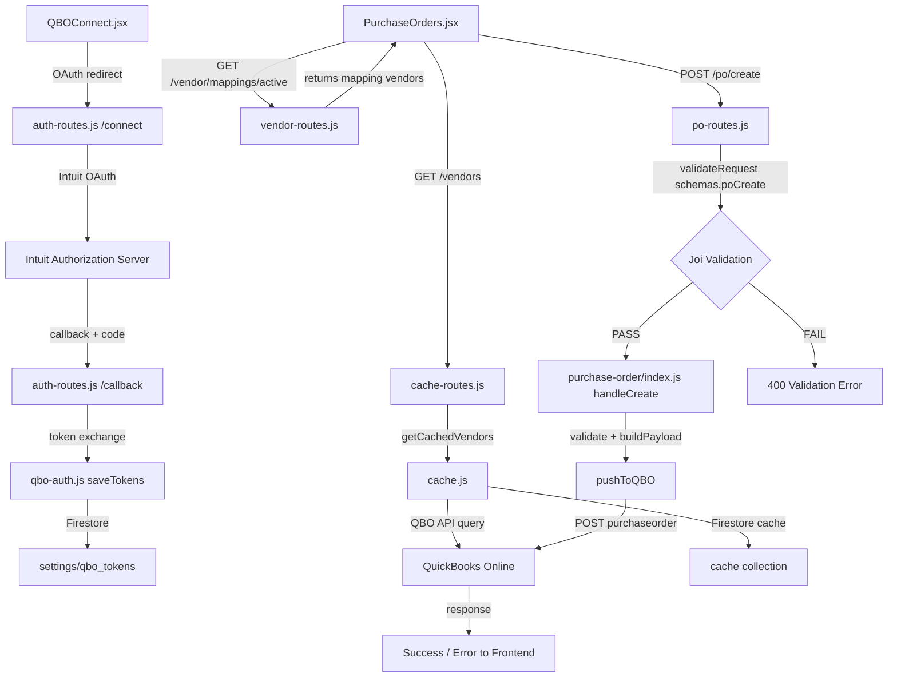

# QBO Full Connection Audit & Repair Plan

## Date: 2026-04-12–13
## Scope: Complete QuickBooks Online integration — authentication, data sync, vendor mapping, purchase order creation, deployment, and verification

---

## Executive Summary

After a thorough codebase inspection of **all QBO-related files** across frontend and backend, I found **2 critical bugs that block PO creation**, **1 medium issue causing vendor dropdown breakage**, and several minor improvements. The core architecture is sound — OAuth flow, token management, caching, and payload construction are well-designed. However, two data-shape mismatches between frontend/backend will prevent any successful PO creation until fixed.

---

## Architecture Overview



---

## Findings: Critical Bugs (Blockers)

### Bug #1: Joi Schema Field Name Mismatch — BLOCKS ALL PO CREATION

**File:** [`functions/api/middleware.js`](functions/api/middleware.js:77)
**Severity:** 🔴 CRITICAL — Every PO creation fails with validation error

**Problem:** The Joi `lineItemSchema` used by `poCreate` expects fields named `rate`, but the frontend sends `unitPrice`.

**Backend schema (line 77-83):**
```js
const lineItemSchema = Joi.object({
  itemId: Joi.string().trim().optional(),
  description: Joi.string().trim().required(),
  quantity: Joi.number().positive().required(),
  rate: Joi.number().min(0).required(),        // ← EXPECTS 'rate'
  accountId: Joi.string().trim().optional(),
});
```

**Frontend payload ([PurchaseOrders.jsx:765-775](frontend/src/pages/PurchaseOrders.jsx:765)):**
```js
lines: validLines.map((l) => ({
  itemId: l.itemId,
  sku: l.sku,
  description: l.description,
  quantity: parseFloat(l.qty) || 1,
  unit: l.unit,
  unitPrice: parseFloat(l.unitPrice) || 0,    // ← SENDS 'unitPrice'
})),
```

**Result:** Joi rejects every PO with: `Validation error: "lines[0].rate" is required`

**Fix:** Update `lineItemSchema` to accept `unitPrice` instead of (or in addition to) `rate`. Also add `poNumber`, `vendorId`, `sku`, and `unit` as allowed fields since the frontend sends them.

---

### Bug #2: Vendor Dropdown Property Name Mismatch — Vendor Selection Broken

**File:** [`frontend/src/pages/PurchaseOrders.jsx`](frontend/src/pages/PurchaseOrders.jsx:921)
**Severity:** 🔴 CRITICAL — Selecting a vendor sets undefined values

**Problem:** The vendor dropdown in CreateTab uses `v.Id` and `v.DisplayName`, but vendors loaded from `getActiveVendors()` come in mapping format with `qbo_id` and `qbo_name`.

**Data flow:**
1. Main component calls `api.getActiveVendors()` → backend `GET /vendor/mappings/active`
2. Returns: `[{ qbo_id: "123", qbo_name: "Daltile", active: false, shopify_code: "", visible: true }]`
3. Passed to `<CreateTab vendors={vendors} ... />`
4. Dropdown renders (line 921-938):
   ```jsx
   <button key={v.Id}>                    {/* v.Id === undefined */}
     onClick={() => {
       setField("vendorId", v.Id);         /* undefined */
       setField("vendorName", v.DisplayName); /* undefined */
     }}
   >
     <div>{v.DisplayName}</div>            {/* Renders empty */}
   ```
5. Search filter (line 655): `v.DisplayName?.toLowerCase()` — never matches anything

**Result:** Vendor dropdown shows empty entries; selecting one sets vendorId/vendorName to undefined; submission guard `if (!form.vendorId)` blocks submit with confusing error.

**Fix:** Normalize vendor data after loading. Either:
- Option A: Transform mapping vendors to include `Id`/`DisplayName` aliases when loading
- Option B: Change dropdown to use `qbo_id`/`qbo_name` and map to `Id`/`DisplayName` before setting form state

**Option A is cleaner** — transform in the main component's `loadVendors()` so all downstream code works uniformly with `Id`/`DisplayName`.

---

## Findings: Medium Issues

### Issue #3: ShipTo Address Displayed but Not Sent to QBO

**File:** [`frontend/src/pages/PurchaseOrders.jsx`](frontend/src/pages/PurchaseOrders.jsx:948), [`functions/modules/purchase-order/index.js`](functions/modules/purchase-order/index.js:213)

The UI shows a hardcoded Ship To address block (American Tile Depot address) when a vendor is selected, but `buildPayload()` does not include a `ShipAddr` field in the QBO payload. This is cosmetic — QBO will use the company default shipping address. Not a bug per se, but could confuse users who expect their ship-to to appear on the QBO PO.

**Recommendation:** Either remove the ShipTo display from the UI, or add `ShipAddr` to the QBO payload.

---

### Issue #4: Frontend Sends `date` but Backend Expects `txnDate`

**Files:** [PurchaseOrders.jsx:762](frontend/src/pages/PurchaseOrders.jsx:762), [purchase-order/index.js:314](functions/modules/purchase-order/index.js:314)

Frontend sends `date: form.txnDate`. Backend normalizes this in `handleCreate()` (line 315-317): `if (data.date && !data.txnDate) data.txnDate = data.date`. This works but is fragile. Already handled — low priority.

---

## Findings: What Looks Correct ✅

These areas were inspected and found to be working correctly:

| Area | Status | Notes |
|------|--------|-------|
| **OAuth Flow** (google-auth.js) | ✅ | CSRF protection, correct scopes, proper token exchange |
| **Token Storage** (qbo-auth.js saveTokens) | ✅ | Firestore merge, expiry timestamps, refresh token preserved |
| **Token Refresh** (qbo-auth.js getValidAccessToken) | ✅ | 5-min buffer, auto-refresh, no stale module-level cache |
| **Realm ID Management** | ✅ | Stored during OAuth, retrieved per-request |
| **Base URL Resolution** (getQboBaseUrl) | ✅ | Production/sandbox via Firestore settings |
| **QBO API Query Layer** (cache.js fetchFromQbo) | ✅ | Proper headers, error handling, intuit_tid capture |
| **Pagination** (fetchAllFromQbo) | ✅ | 1000/page loop until exhausted |
| **Cache Layer** (cache.js) | ✅ | 24h TTL, stale fallback, Firestore-backed |
| **PO Payload Structure** (buildPayload) | ✅ | Correct QBO v3 format, ItemBasedExpenseLineDetail |
| **PO Push** (pushToQBO) | ✅ | Error parsing from Fault response, logging |
| **Draft Save/Approve Flow** | ✅ | Strip internal fields, re-validate on approve |
| **AI Review Integration** | ✅ | Opt-out flag, prompt building, JSON parse |
| **Rules Engine Wiring** | ✅ | Applied before validation in handleCreate |
| **Auth Status Endpoint** | ✅ | Returns connected, realmId, expiry, lastRefreshed |
| **Disconnect** | ✅ | FieldValue.delete for sensitive fields |
| **Company Info Test** | ✅ | 8s timeout, proper error handling |
| **CORS Middleware** | ✅ | Allows both hosting and CF origins |
| **Global Error Handler** | ✅ | Error codes with human-readable fix messages |
| **Frontend API Client** (api.js) | ✅ | JSON parse errors, fix suggestions, consistent shape |
| **QBO Connect Page UI** | ✅ | Colour-coded expiry, countdown ticker, reconnect |
| **Item Search/Select** | ✅ | Fuzzy search, vendor-prioritized, create-new modal |
| **Activity Logging** | ✅ | All QBO operations logged to Firestore |

---

## Detailed Fix Plan

### Phase 1: Fix Critical Backend Schema (Bug #1)

**File:** `functions/api/middleware.js`

Changes:
1. Rename `rate` → `unitPrice` in `lineItemSchema`
2. Add `poNumber`, `vendorId`, `sku`, `unit`, `vendorMessage` as optional allowed fields on line items
3. Make `vendorName` optional (since `vendorId` should also be accepted)
4. Add `stripUnknown: true` to prevent future mismatches

```js
// BEFORE (broken):
const lineItemSchema = Joi.object({
  itemId: Joi.string().trim().optional(),
  description: Joi.string().trim().required(),
  quantity: Joi.number().positive().required(),
  rate: Joi.number().min(0).required(),
  accountId: Joi.string().trim().optional(),
});

const schemas = {
  poCreate: Joi.object({
    vendorName: Joi.string().trim().min(1).required(),
    lines: Joi.array().items(lineItemSchema).min(1).required(),
    // ...
  }),
};

// AFTER (fixed):
const lineItemSchema = Joi.object({
  itemId: Joi.string().trim().optional(),
  itemName: Joi.string().trim().optional(),
  sku: Joi.string().trim().allow('').optional(),
  description: Joi.string().trim().required(),
  quantity: Joi.number().positive().required(),
  qty: Joi.number().positive().optional(),       // accept either name
  unitPrice: Joi.number().min(0).required(),     // match frontend field name
  unit: Joi.string().trim().allow('').optional(),
}).options({ stripUnknown: true });

const schemas = {
  poCreate: Joi.object({
    vendorId: Joi.string().trim().allow('').optional(),   // accept ID-based lookup
    vendorName: Joi.string().trim().min(1).optional(),     // also accept name
    poNumber: Joi.string().trim().min(1).required(),
    date: Joi.string().isoDate().optional(),               // accept frontend field name
    txnDate: Joi.string().isoDate().optional(),
    memo: Joi.string().trim().allow('').optional(),
    vendorMessage: Joi.string().trim().allow('').optional(),
    lines: Joi.array().items(lineItemSchema).min(1).required(),
    autoApprove: Joi.boolean().optional(),
    aiEnabled: Joi.boolean().optional(),
  }).options({ stripUnknown: true }),
  // ... other schemas unchanged
};
```

---

### Phase 2: Fix Vendor Property Names (Bug #2)

**File:** `frontend/src/pages/PurchaseOrders.jsx`

Change the `loadVendors()` function in the main component to normalize mapping-format vendors into the shape the rest of the component expects:

```js
// In loadVendors(), after fetching activeVendors:
// Normalize: convert { qbo_id, qbo_name, ... } → { Id, DisplayName, ... }
activeVendors = activeVendors.map((v) => ({
  Id: v.qbo_id || v.Id,
  DisplayName: v.qbo_name || v.DisplayName,
  PrimaryEmailAddr: v.PrimaryEmailAddr || {},
  active: v.active,
  shopify_code: v.shopify_code,
  visible: v.visible !== false,
}));
```

Also update the search filter to handle both naming conventions:
```js
const filteredVendors = useMemo(() => {
  if (!vendorSearch.trim()) return vendors;
  const search = vendorSearch.toLowerCase();
  return vendors.filter((v) => {
    const name = (v.DisplayName || v.qbo_name || '').toLowerCase();
    return name.includes(search);
  });
}, [vendors, vendorSearch]);
```

And update the dropdown rendering to use both:
```jsx
<button key={v.Id || v.qbo_id} ...>
  onClick={() => {
    setField('vendorId', v.Id || v.qbo_id);
    setField('vendorName', v.DisplayName || v.qbo_name);
    // Email lookup from qboVendors by either ID format
    const qboVendor = qboVendors.find((qv) =>
      String(qv.Id) === String(v.Id || v.qbo_id)
    );
    ...
  }}
>
  <div>{v.DisplayName || v.qbo_name}</div>
</button>
```

---

### Phase 3: Verify and Test

After fixes, run these tests in order:

#### Test 1: Auth Status Check
```
GET https://us-central1-atd-qbo-platform.cloudfunctions.net/api/auth/status
Expected: { success: true, data: { connected: true, realmId: "...", tokenExpiry: "..." } }
```

#### Test 2: Company Info (Live QBO Call)
```
GET https://us-central1-atd-qbo-platform.cloudfunctions.net/api/qbo/company-info
Expected: { success: true, data: { CompanyInfo: { CompanyName: "..." } } }
```

#### Test 3: Vendor Sync
```
GET https://us-central1-atd-qbo-platform.cloudfunctions.net/api/vendors
Expected: { success: true, data: { vendors: [...], lastSyncedAt: "..." } }
```

#### Test 4: Active Vendor Mappings
```
GET https://us-central1-atd-qbo-platform.cloudfunctions.net/api/vendor/mappings/active
Expected: { success: true, data: { vendors: [{ qbo_id, qbo_name, active, ... }] } }
```

#### Test 5: Items Sync
```
GET https://us-central1-atd-qbo-platform.cloudfunctions.net/api/items
Expected: { success: true, data: { items: [...], lastSyncedAt: "..." } }
```

#### Test 6: PO Creation — Draft Mode
```bash
POST https://us-central1-atd-qbo-platform.cloudfunctions.net/api/po/create
Body: {
  "poNumber": "TEST-001",
  "vendorId": "<real_vendor_id_from_test_3>",
  "vendorName": "<real_vendor_name>",
  "date": "2026-04-13",
  "memo": "Test PO from audit",
  "lines": [{
    "description": "Test Tile Product",
    "quantity": 100,
    "unitPrice": 2.49,
    "unit": "Sq Ft"
  }],
  "autoApprove": false,
  "aiEnabled": false
}
Expected: { success: true, draftId: "...", message: "Draft saved for review." }
```

#### Test 7: PO Creation — Auto-Approve Mode (creates real PO in QBO!)
```bash
# Same as above but "autoApprove": true
Expected: { success: true, data: { Id: "...", DocNumber: "TEST-002", TotalAmt: 249.00 } }
```

#### Test 8: Draft Approval
```bash
POST https://us-central1-atd-qbo-platform.cloudfunctions.net/api/po/approve/<draftId_from_test_6>
Expected: { success: true, data: { Id: "..." } }
```

#### Test 9: Error Handling — Missing Vendor
```bash
POST .../api/po/create with invalid vendorId
Expected: { success: false, errors: ["Vendor '...' not found in QuickBooks"] }
```

#### Test 10: Error Handling — Empty Lines
```bash
POST .../api/po/create with empty description
Expected: 400 validation error
```

---

### Phase 4: Deployment

1. Commit all changes to git
2. `firebase deploy --only functions` — backend
3. `firebase deploy --only hosting` — frontend
4. Wait for Cloud Functions cold start (~30s)

---

### Phase 5: Visual Verification

Using Puppeteer/browser:
1. Open `https://atd-qbo-platform.web.app/qbo-connect`
2. Verify connection status shows green/connected
3. Click "Test Connection" → verify success message
4. Navigate to Purchase Orders
5. Verify vendor dropdown loads and shows vendor names
6. Select a vendor → verify name appears, ship-to shows
7. Fill in PO number, add line item, select item from search
8. Submit as draft → verify success message
9. Switch to Pending Drafts tab → verify draft appears
10. Optionally: submit with auto-approve → verify QBO success

---

## Files to Modify

| File | Changes |
|------|---------|
| `functions/api/middleware.js` | Fix `lineItemSchema` and `poCreate` Joi schemas to match frontend payload |
| `frontend/src/pages/PurchaseOrders.jsx` | Normalize vendor property names in `loadVendors()` and dropdown render |

**Total: 2 files to modify**

---

## Risk Assessment

| Risk | Likelihood | Impact | Mitigation |
|------|-----------|--------|------------|
| QBO tokens expired during testing | Medium | High | Refresh token button available; auto-refresh should handle |
| Joi schema change breaks other consumers | Low | Medium | Only `poCreate` uses `lineItemSchema`; invoice/bill have separate schemas |
| Vendor normalization misses edge cases | Low | Medium | Handle both `Id`/`qbo_id` formats defensively |
| QBO API rate limiting | Low | Low | Only making a few test calls |
| Firebase functions cold start timeout | Low | Medium | First call may be slow; retry built in |

---

## Success Criteria

1. ✅ `POST /api/po/create` accepts the frontend payload without validation errors
2. ✅ Vendor dropdown shows correct names and selection works
3. ✅ Draft PO creation returns a draftId
4. ✅ Auto-approve PO creation creates a real PO in QuickBooks Online
5. ✅ Draft approval pushes to QBO successfully
6. ✅ Error responses are clear and actionable
7. ✅ All tests pass against live production environment
8. ✅ Visual verification confirms UI works end-to-end
