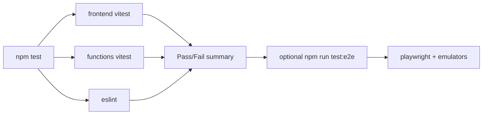

# Review Test Suite Plan

Goal: one command (`npm test`) that every review runs, covering frontend units, backend units, lint, and optional e2e smoke.

## Current State
- Frontend: Vitest configured ([`frontend/vitest.config.js`](frontend/vitest.config.js:1)); tests exist for [`frontend/src/utils/api.test.js`](frontend/src/utils/api.test.js:1), [`frontend/src/utils/helpers.test.js`](frontend/src/utils/helpers.test.js:1), [`frontend/src/smoke.test.js`](frontend/src/smoke.test.js:1).
- Functions: no tests, `firebase-functions-test` installed but unused.
- Root: Playwright installed but no config; two e2e files in [`tests/`](tests/e2e-smoke.test.js:1) with no runner wiring.
- Root `npm test` does not exist; no CI workflow.

## Gaps
1. No root-level `test` script aggregating all suites.
2. No backend unit tests (routes, rules engine, middleware, core/cache).
3. No Playwright config or runnable e2e command.
4. No lint/format check.
5. No CI pipeline to enforce tests on PR.
6. No pre-review checklist tying this together.

## Plan (numbered, parallelizable where marked [P])

### 1. Root test orchestration
- File: [`package.json`](package.json:1)
- Add scripts:
  - `test`: runs `test:frontend` + `test:functions` + `lint` sequentially.
  - `test:frontend`: `cd frontend && npm run test -- --run`.
  - `test:functions`: `cd functions && npm test`.
  - `test:e2e`: `playwright test`.
  - `test:all`: `npm test && npm run test:e2e`.
  - `lint`: `eslint frontend/src functions --ext .js,.jsx`.
- Add devDeps: `eslint`, `@playwright/test`.
- Acceptance: `npm test` from root runs and exits 0 on green.

### 2. Functions unit test harness [P]
- Files:
  - [`functions/package.json`](functions/package.json:1) — add `"test": "vitest run"`, devDeps: `vitest`, `supertest`.
  - `functions/vitest.config.js` (new) — node env, include `**/*.test.js`.
  - `functions/api/__tests__/middleware.test.js` — auth + error handler.
  - `functions/api/__tests__/rules-engine.test.js` — rule evaluation cases.
  - `functions/api/__tests__/health-routes.test.js` — supertest against Express app with mocked QBO.
  - `functions/core/__tests__/cache.test.js` — TTL, invalidation, key generation.
  - `functions/core/__tests__/qbo-auth.test.js` — token refresh flow, mocked fetch.
- Acceptance: `cd functions && npm test` passes with ≥60% coverage on `core/` and `api/middleware.js`.

### 3. Frontend test expansion [P]
- Files (new):
  - `frontend/src/components/shared/__tests__/Toast.test.jsx`
  - `frontend/src/components/shared/__tests__/Toggle.test.jsx`
  - `frontend/src/utils/__tests__/dataCache.test.js`
  - `frontend/src/utils/__tests__/useFeatures.test.js`
- Update [`frontend/vitest.config.js`](frontend/vitest.config.js:13) coverage `include` to `src/{utils,components/shared}/**`.
- Acceptance: utils coverage ≥80%, shared components smoke-render without error.

### 4. Playwright e2e wiring [P]
- Files:
  - `playwright.config.js` (new) — baseURL `http://127.0.0.1:5002`, reporter html, single worker, retries 1.
  - Fix [`tests/e2e-smoke.test.js`](tests/e2e-smoke.test.js:13) to use `@playwright/test` (already does) — verify selectors against current [`frontend/src/App.jsx`](frontend/src/App.jsx:1).
  - Add `tests/fixtures/` for test auth token + QBO mock.
  - `scripts/run-e2e.sh` — starts emulators, waits, runs playwright, tears down.
- Acceptance: `npm run test:e2e` runs against emulators and passes smoke happy path.

### 5. Lint + format [P]
- Files:
  - `.eslintrc.cjs` (root) — extends `eslint:recommended`, `plugin:react/recommended`; ignores `dist`, `node_modules`.
  - `.prettierrc` — 2-space, single quotes, trailing commas es5.
- Acceptance: `npm run lint` returns 0 warnings on existing code (fix or disable rules as needed).

### 6. Firestore rules tests
- File: `tests/rules/firestore.rules.test.js` using `@firebase/rules-unit-testing`.
- Acceptance: verifies [`firestore.rules`](firestore.rules:1) allows auth'd read/write, denies anon.

### 7. CI workflow
- File: `.github/workflows/review.yml`
- Jobs: `install` → matrix `[frontend, functions]` unit tests → `lint` → upload coverage.
- Triggers: `pull_request`, `push` to main.
- Acceptance: workflow green on a clean PR; red if any suite fails.

### 8. Review runbook
- File: `docs/REVIEW_CHECKLIST.md`
- Contents: one-liner `npm test`, how to run e2e locally, coverage thresholds, what to do on failure.
- Acceptance: referenced from [`README.md`](README.md:1) and the Review mode.

### 9. Wire into Review mode
- File: [`.kilocode/rules/rules-review.md`](.kilocode/rules/rules-review.md:1)
- Add step: "Run `npm test` before approving. Paste summary into review."
- Acceptance: Review mode instructs reviewer to execute the suite.

## Execution Flow

## Parallelizable Groups
- Group A [P]: Tasks 2, 3, 5, 6 (independent file additions).
- Group B: Task 1 (depends on 2, 3, 5 script names).
- Group C: Task 4 (depends on 1).
- Group D: Task 7 (depends on 1).
- Group E: Tasks 8, 9 (depends on 1, 7).

## Acceptance Criteria (overall)
- `npm test` at repo root runs frontend + functions unit tests + lint in under 60s and exits 0.
- `npm run test:e2e` runs Playwright smoke against local emulators.
- CI blocks PR merge on failure.
- `docs/REVIEW_CHECKLIST.md` exists and is linked from README and Review mode rules.
