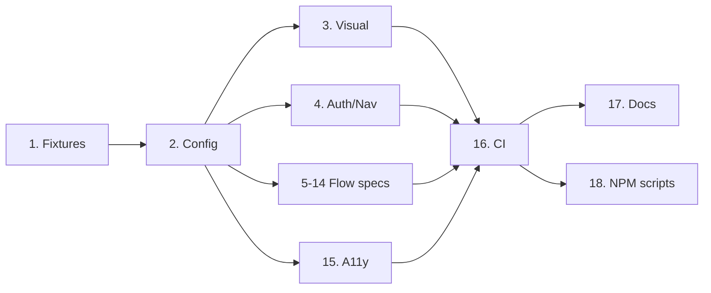

# User & Visual Test Plan — ATD QBO Platform

Extends existing Playwright setup ([`playwright.config.js`](../playwright.config.js:1), [`tests/e2e-smoke.test.js`](../tests/e2e-smoke.test.js:1)) with complete user-flow E2E + visual regression coverage across all 15 pages.

## Stack
- **Runner:** Playwright (already installed)
- **Visual:** `toHaveScreenshot()` with baseline snapshots in `tests/e2e/__screenshots__/`
- **Backend:** Firebase emulators (`:5002` hosting, `:5001` functions, `:8080` firestore)
- **Mocking:** `page.route()` to stub QBO + Google Sheets + AI endpoints with fixtures
- **Auth:** Mock Firebase auth via `localStorage` seed + `/api/auth/*` route interception
- **Viewports:** Desktop `1440x900`, Mobile `390x844`

## Pages Under Test (15)
Dashboard, Bills, Invoices, PurchaseOrders, Orders, Payments, Expenses, Settings, Help, AIChat, VendorManagement, Rules, ActivityLog, HealthCheck, QBOConnect

---

## Numbered Task Plan

### 1. Test infrastructure — [`tests/e2e/fixtures/`](../tests/e2e/fixtures/)
**Files:** `tests/e2e/fixtures/qbo-mocks.js`, `tests/e2e/fixtures/auth.js`, `tests/e2e/fixtures/seed-data.json`
- Create reusable `authenticatedPage` Playwright fixture that seeds auth token + mocks `/api/auth/status`.
- JSON fixtures for: vendors (10), items (20), POs (5), bills (5), invoices (5), payments (5), expenses (5), orders (5).
- Helper `mockQboRoutes(page)` intercepting all `/api/qbo/*`, `/api/vendors`, `/api/items`, `/api/bills`, `/api/invoices`, `/api/pos`, `/api/payments`, `/api/expenses`, `/api/orders`, `/api/health`, `/api/ai/*`, `/api/sheets/*`, `/api/activity-log`, `/api/rules`.
- **Acceptance:** importing fixture in a test auto-logs in and returns deterministic data; no network calls leave the browser.

### 2. Playwright config update — [`playwright.config.js`](../playwright.config.js:1)
- Add `projects`: `chromium-desktop` (1440x900), `chromium-mobile` (390x844).
- Set `testDir: './tests/e2e'`, keep legacy `./tests/e2e-smoke.test.js` via `testMatch`.
- Add `expect.toHaveScreenshot` config: `maxDiffPixelRatio: 0.01`, `animations: 'disabled'`, `caret: 'hide'`.
- Add `webServer` block to auto-start `firebase emulators:start` if not running.
- **Acceptance:** `npm run test:e2e` boots emulators, runs both viewports.

### 3. Visual regression suite — [`tests/e2e/visual.spec.js`](../tests/e2e/visual.spec.js)
- One `test.describe` per page; visit route, wait for network idle + page-specific selector, call `expect(page).toHaveScreenshot()`.
- Parametrize across 15 routes × 2 viewports (30 snapshots).
- Mask dynamic regions (timestamps, spinners) via `mask:` option.
- **Parallelizable:** ✅ (independent of flow tests)
- **Acceptance:** 30 baseline PNGs committed under `tests/e2e/__screenshots__/visual.spec.js/`; re-run is pixel-stable.

### 4. Auth & navigation flow — [`tests/e2e/flows/auth-nav.spec.js`](../tests/e2e/flows/auth-nav.spec.js)
- Unauthenticated redirect to login; login → dashboard; sidebar navigation hits all 15 routes; mobile hamburger toggle; logout clears session.
- **Acceptance:** all routes reachable; 401 state shows QBO connect banner.

### 5. Purchase Order full flow — [`tests/e2e/flows/purchase-order.spec.js`](../tests/e2e/flows/purchase-order.spec.js)
- Create PO (vendor select, add 3 line items, price calc), save draft, edit draft, submit for review, approve → assert QBO sync mock called, reject flow, fuzzy item search, duplicate PO, delete PO.
- **Acceptance:** ≥8 assertions per flow; toast messages verified; table row count updates.

### 6. Bills flow — [`tests/e2e/flows/bills.spec.js`](../tests/e2e/flows/bills.spec.js)
- Import from Google Sheets (mocked), create bill, attach to PO, pay bill, filter/search, export CSV.
- **Parallelizable:** ✅ with 5, 7–11.

### 7. Invoices flow — [`tests/e2e/flows/invoices.spec.js`](../tests/e2e/flows/invoices.spec.js)
- Create invoice, send, mark paid, void, filter by customer/date, sync to QBO.
- **Parallelizable:** ✅

### 8. Payments flow — [`tests/e2e/flows/payments.spec.js`](../tests/e2e/flows/payments.spec.js)
- Record payment, apply to multiple invoices/bills, refund, bulk sync.
- **Parallelizable:** ✅

### 9. Expenses flow — [`tests/e2e/flows/expenses.spec.js`](../tests/e2e/flows/expenses.spec.js)
- Create expense, categorize, attach receipt placeholder, approve.
- **Parallelizable:** ✅

### 10. Orders & fulfillment — [`tests/e2e/flows/orders.spec.js`](../tests/e2e/flows/orders.spec.js)
- View orders, update fulfillment status, mark shipped, link to PO.
- **Parallelizable:** ✅

### 11. Vendor management & Rules — [`tests/e2e/flows/vendors-rules.spec.js`](../tests/e2e/flows/vendors-rules.spec.js)
- Add/edit/delete vendor, map vendor to QBO, create rule, toggle rule on/off, rule triggers on PO.
- **Parallelizable:** ✅

### 12. AI Chat flow — [`tests/e2e/flows/ai-chat.spec.js`](../tests/e2e/flows/ai-chat.spec.js)
- Send message (mocked AI response), switch provider, stream render, error state (AI unavailable), clear conversation.
- **Parallelizable:** ✅

### 13. Settings & Health — [`tests/e2e/flows/settings-health.spec.js`](../tests/e2e/flows/settings-health.spec.js)
- Toggle features via [`useFeatures.js`](../frontend/src/utils/useFeatures.js:1), change AI provider, QBO reconnect, health check shows all green, force failure shows red.
- **Parallelizable:** ✅

### 14. Activity log & search — [`tests/e2e/flows/activity-search.spec.js`](../tests/e2e/flows/activity-search.spec.js)
- Filter by action type/date, pagination, fuzzy search across pages via [`FuzzySearch.jsx`](../frontend/src/components/shared/FuzzySearch.jsx:1).
- **Parallelizable:** ✅

### 15. Accessibility pass — [`tests/e2e/a11y.spec.js`](../tests/e2e/a11y.spec.js)
- Install `@axe-core/playwright`; run axe scan on all 15 pages; fail on serious/critical violations.
- **Acceptance:** zero serious+critical a11y issues, or documented exceptions.

### 16. CI integration — [`.github/workflows/e2e.yml`](../.github/workflows/e2e.yml)
- Job: checkout → setup node → install → build frontend → start emulators → `npx playwright test` → upload HTML report + diff screenshots on failure.
- Trigger: PR + push to main.
- **Acceptance:** green CI run; artifacts accessible for 14 days.

### 17. Documentation — [`docs/TESTING.md`](../docs/TESTING.md)
- How to run locally, update baselines (`--update-snapshots`), interpret diff report, add new page tests.
- **Acceptance:** new dev can run full suite from README in one command.

### 18. NPM scripts — [`package.json`](../package.json:6)
- Add: `test:e2e:visual`, `test:e2e:flows`, `test:e2e:update`, `test:e2e:ui` (Playwright UI mode).
- **Acceptance:** `npm run test:e2e:update` regenerates snapshots cleanly.

---

## Parallelization Groups
- **Group A (sequential setup):** 1 → 2
- **Group B (parallel after A):** 3, 4, 15
- **Group C (parallel after A):** 5, 6, 7, 8, 9, 10, 11, 12, 13, 14
- **Group D (after all tests exist):** 16, 17, 18

## Dependency Flow

## Exit Criteria
- All 15 pages have visual baselines × 2 viewports = 30 snapshots.
- All core user flows covered by functional assertions.
- Zero critical axe violations.
- CI green on PR with artifact upload working.
- `npm run test:all` passes locally in under one emulator cycle.
