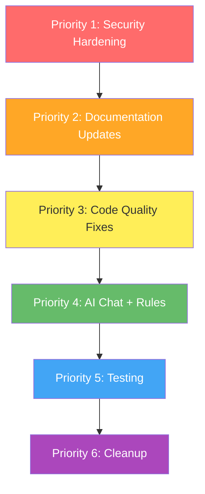

# ATD QBO Platform - Finalization Plan

**Date:** April 14, 2026
**Repository:** torosasik/atd-qbo-platform
**Current State:** Functional and deployed. All 6 modules operational. Multiple prior audits identified issues, some resolved, many still open.

---

## What's Already Been Fixed

Before diving into remaining work, here's what previous sessions resolved:

| Item | Status |
|------|--------|
| Vite proxy path rewrite | Fixed |
| Favicon and robots.txt | Fixed (files exist in `frontend/public/`) |
| Version consistency (all 1.0.0) | Fixed |
| Node.js upgraded to 22 | Fixed (`firebase.json` and `functions/package.json`) |
| firebase-functions upgraded to 5.1.1 | Fixed |
| Routes split into individual files | Fixed (monolithic `routes.js` eliminated) |
| Expense module added to settings | Fixed |
| `.env.example` updated for v2 pattern | Fixed |
| PO item validation regression | Fixed |
| Draft approval data shape | Fixed |
| API response shape consistency | Fixed |
| Item search optional chaining | Fixed |
| 404 handler returns JSON | Fixed |
| Global error handler with Firestore logging | Fixed |

---

## Remaining Work - Prioritized

### Priority 1: Security Hardening (Critical for Production)

These are blockers for any real production use.

**1.1 Add API authentication middleware**
- Location: [`functions/index.js`](functions/index.js:45)
- Currently all `/api/*` routes are publicly accessible with zero auth
- Add Firebase Auth ID token verification middleware, or at minimum an API key/shared secret header check
- Exception: `/api/auth/callback` (OAuth redirect) and `/api/health` should remain public

**1.2 Tighten Firestore security rules**
- Location: [`firestore.rules`](firestore.rules:5)
- Current rule: `allow read, write: if request.auth != null` on all documents
- Write granular per-collection rules:
  - `settings/qbo_tokens`: restrict to admin/service account only
  - `settings/app_config`: read any authenticated, write admin only
  - `drafts/*`: read/write authenticated
  - `activityLog/*`: read authenticated, write server-side only
  - `vendorCache/*`: read authenticated, write server-side only

**1.3 Remove hardcoded QBO account IDs**
- Verify if hardcoded values `'80'`, `'81'`, `'67'`, `'1'` still exist in route files
- Replace with configurable values from `settings.qbo.default_income_account`, etc. (already defined in [`settings.js`](functions/core/settings.js:70))

### Priority 2: Documentation Updates

**2.1 Update README.md**
- Location: [`README.md`](README.md:7)
- Change Invoices, Bills, Payments from "Coming soon" to their actual status
- Replace `firebase functions:config:set` instructions with the v2 `.env` pattern
- Add link to `docs/QUICK_START.md` and `docs/SETUP.md`

**2.2 Update CLAUDE.md**
- Location: [`CLAUDE.md`](CLAUDE.md:53)
- Update architecture tree to reflect actual directory structure (modules use `module-name/index.js` pattern, not flat files)
- Add missing core files: `google-auth.js`, `settings.js`, `sheets-connector.js`
- Update module roadmap table: all modules are implemented, not "Building" or "Planned"
- Update Phase to reflect current state (Phase 2 complete, now in finalization/hardening)

**2.3 Fix APP_VERSION display**
- Location: [`AppLayout.jsx:6`](frontend/src/components/shared/AppLayout.jsx:6)
- Shows `v0.1.0` as fallback. Should be `v1.0.0` to match package.json versions

### Priority 3: Code Quality Fixes

**3.1 Remove em dashes from user-facing text**
- 15 instances across: `Settings.jsx`, `Expenses.jsx`, `QBOConnect.jsx`, `Help.jsx`, `AppLayout.jsx`, `AIChat.jsx`, `PurchaseOrders.jsx`
- Replace `\u2014` with hyphens, commas, colons, or periods per CLAUDE.md coding conventions

**3.2 Replace console.error with Toast notifications**
- 11 instances across 6 frontend files
- Errors should surface to the user via the existing [`Toast`](frontend/src/components/shared/Toast.jsx) component, not just go to browser console

**3.3 Fix duplicate utility functions in NewDashboard**
- Location: [`NewDashboard.jsx`](frontend/src/pages/NewDashboard.jsx)
- Local `formatCurrency()` and `formatDateTime()` should import from [`helpers.js`](frontend/src/utils/helpers.js)

**3.4 Fix NewDashboard importing full PurchaseOrders component**
- Location: [`NewDashboard.jsx`](frontend/src/pages/NewDashboard.jsx)
- Importing the entire 67K PurchaseOrders component defeats lazy loading
- Extract shared logic or use a lighter data-fetching approach

**3.5 Deduplicate getQboBaseUrl**
- Two implementations: [`cache.js:9`](functions/core/cache.js:9) and [`qbo-auth.js:168`](functions/core/qbo-auth.js:168)
- Consolidate into one location (likely `qbo-auth.js`) and import elsewhere

**3.6 Clean up empty comingSoonItems**
- Location: [`AppLayout.jsx`](frontend/src/components/shared/AppLayout.jsx)
- Either remove the "Coming Soon" nav section entirely, or populate it with planned features like "Notifications"

### Priority 4: AI Chat + Rules Integration

**4.1 Connect AI Chat to Business Rules Engine**
- Location: [`ai-routes.js`](functions/api/ai-routes.js) and [`ai-chat/index.js`](functions/modules/ai-chat/index.js)
- The Rules Engine exists ([`rules-engine.js`](functions/api/rules-engine.js)) with CRUD API and frontend page
- AI Chat should be able to query, suggest, and apply business rules
- This was partially started but may have been interrupted (noted in session handover)

### Priority 5: Testing

**5.1 Add backend unit tests**
- Zero backend tests currently exist
- Priority targets:
  - `functions/core/settings.js` (settings CRUD)
  - `functions/core/cache.js` (vendor/item caching)
  - `functions/core/qbo-auth.js` (token refresh logic)
  - `functions/modules/purchase-order/index.js` (PO creation/validation)

**5.2 Expand frontend tests**
- Current: only [`api.test.js`](frontend/src/utils/api.test.js) and [`helpers.test.js`](frontend/src/utils/helpers.test.js)
- Add component tests for critical flows (PO creation form, vendor dropdown, order status toggle)
- Vitest is already configured

**5.3 Add CI/CD pipeline**
- No automated testing or deployment currently
- Add GitHub Actions workflow for: lint, test, build, deploy preview

### Priority 6: Cleanup

**6.1 Remove/rename screenshot directories**
- `DO NOT UPLOAD - SCREENSHOOTS/` (misspelled)
- `DO NOT UPLOAD - SCREENSHOTS/`
- Add to `.gitignore` if not already, or remove from repo

**6.2 Archive stale documentation**
- Files in `docs/` like `FRONTEND_REVIEW.md`, `FULL_PLATFORM_REVIEW.md`, `UI_REVIEW_PART1-3.md` are from earlier review phases
- Move to `docs/archive/` or delete

**6.3 Clean up plans directory**
- Many plan files are from completed work phases
- Archive completed plans to `plans/archive/`

---

## Execution Order

### Recommended Approach

1. **Security first** - P1 items are the only true blockers. Everything else is polish.
2. **Docs + code quality** can be done in a single pass since they touch many of the same files.
3. **AI Chat integration** is a standalone feature that doesn't block other work.
4. **Testing** should come after code changes stabilize.
5. **Cleanup** is cosmetic and can be done last.

---

## Out of Scope (Already Handled or Deferred)

| Item | Reason |
|------|--------|
| Node.js 22 upgrade | Already done |
| firebase-functions 5.x upgrade | Already at 5.1.1 |
| Route splitting | Already split into individual route files |
| Favicon/robots.txt | Already exist in `frontend/public/` |
| TypeScript migration | Too large for finalization, defer to future |
| Frontend component extraction | Nice-to-have refactor, defer to future |
| Google Safe Browsing report | Manual action, not code-related |
| Intuit Developer Portal redirect URI | Manual action in Intuit dashboard |
