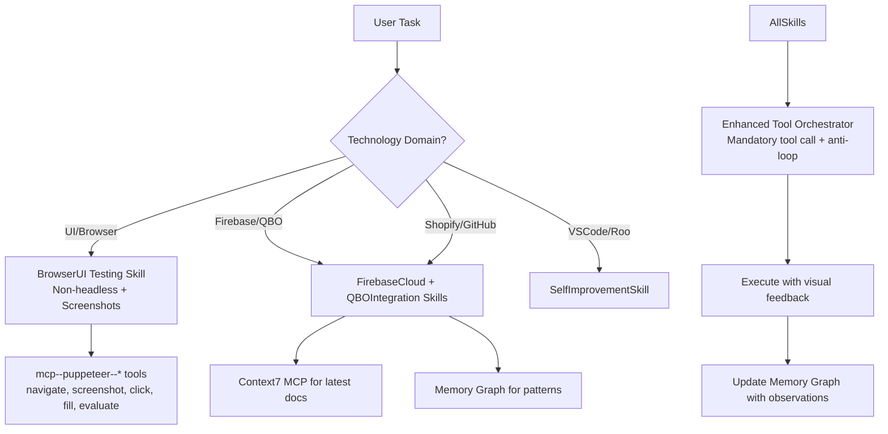

# Enhanced Roo Capabilities Plan

## Objective
Make Roo exceptionally strong at browser automation (non-headless with screenshots), Firebase/Google Cloud, QuickBooks Online, Shopify Admin, GitHub, and VSCode workflows.

## Current State (Validated)
- **Puppeteer MCP**: Successfully tested with [`mcp--puppeteer--puppeteer_navigate`](.kilocode/mcp.json:13) and [`mcp--puppeteer--puppeteer_screenshot`](.kilocode/mcp.json:13). Browser opens visibly, captures UI (see Firebase login screenshot).
- **Memory Graph**: Expanded with entities for BrowserAutomation, QBOIntegration, FirebaseExpertise, ShopifyAdmin, GitHubIntegration, VSCodeWorkflows.
- **Context7 Integration**: Resolved libraries for QuickBooks, Firebase, Puppeteer with high-quality docs available.
- **Existing Skills**: tool-orchestrator, memory-manager, context7-helper already present and improved.

## Proposed Architecture

## New/Updated Skills to Create

1. **browser-ui-testing.md**
   - Specialized patterns for non-headless automation
   - Screenshot-first approach for UI debugging
   - Login handling for Firebase, QBO, Shopify Admin, GitHub
   - Visual verification workflows

2. **firebase-cloud.md**
   - Cloud Functions + Firestore best practices
   - Security rules, emulators, deployment patterns
   - Integration with this project's functions/ directory

3. **qbo-integration.md**
   - OAuth2 token management, webhook patterns
   - Actor system usage from existing modules
   - Common QBO API entities (Invoice, Bill, PurchaseOrder)

4. **shopify-admin.md**
   - Admin panel navigation and automation
   - Order/Payment/Product workflows
   - Visual confirmation via screenshots

5. **Update existing**:
   - tool-orchestrator.md (add screenshot priority)
   - memory-manager.md (add new entities)
   - context7-helper.md (add Shopify/GitHub queries)
   - rules.md and system-prompt.md

## Todo Completion Plan
- [x] Gather capabilities & test puppeteer (non-headless + screenshots validated)
- [x] Expand memory graph
- [ ] Create new skill files in `.kilocode/skills/` and `.roo/rules-code/skills/`
- [ ] Update orchestrator, rules, and system prompts
- [ ] Create comprehensive test scenarios
- [ ] Ask user for prioritization of specific use cases (e.g. "automate Shopify order processing" vs "debug QBO OAuth flow")

## Next Step
Please review this plan. Would you like me to proceed with implementing these skills and updates, or adjust priorities? Specific use cases you want emphasized first?

**I am ready to switch to code mode to implement once you approve.**
