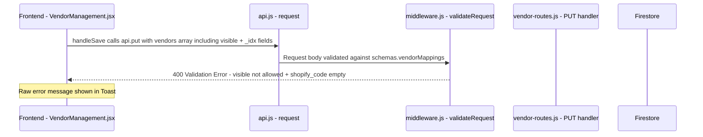

# Fix: Vendor Mapping Save Flow — Validation Schema Mismatch

## Root Cause Analysis

### The Problem (Confirmed)

The frontend sends a payload that **does not match** the backend Joi validation schema. This causes every save attempt to fail with 400 + raw validation errors dumped to the UI.

### Exact Mismatch Location

**File:** [`functions/api/middleware.js`](functions/api/middleware.js:166) — `schemas.vendorMappings`

```js
// CURRENT (broken) schema:
vendorMappings: Joi.object({
  vendors: Joi.array().items(
    Joi.object({
      qbo_id: Joi.string().trim().required(),
      qbo_name: Joi.string().trim().required(),
      active: Joi.boolean().required(),
      shopify_code: Joi.string().trim().optional(),  // ← optional, but empty string fails .trim() semantics in some Joi configs
      // ← MISSING: visible field
    })
  ).required(),
}),
```

**File:** [`frontend/src/pages/VendorManagement.jsx`](frontend/src/pages/VendorManagement.jsx:91) — `handleSave()`

```js
// Payload sent:
await api.put('/vendor/mappings', { vendors });
```

The `vendors` array contains objects with these fields:

| Field | Sent by Frontend? | Accepted by Backend Schema? | Issue |
|-------|-------------------|---------------------------|-------|
| `qbo_id` | ✅ Yes | ✅ Allowed | — |
| `qbo_name` | ✅ Yes | ✅ Allowed | — |
| `active` | ✅ Yes | ✅ Allowed | — |
| `shopify_code` | ✅ Yes (can be `""`) | ✅ Technically optional | Empty string may cause issues depending on Joi config; also error says "not allowed to be empty" |
| `visible` | ✅ Yes (`true` or `false`) | ❌ **NOT in schema** | **Joi rejects unknown keys by default** → `"vendors[134].visible" is not allowed` |
| `_idx` | ✅ Yes (from `filtered.map`) | ❌ **NOT in schema** | Same issue → `"vendors[X]._idx" is not allowed` |

### Why Two Distinct Errors Appear

1. **`"vendors[N].visible" is not allowed`** — The Joi schema does not list `visible` as a valid key. By default, Joi strips or rejects unknown keys. Since the schema doesn't call `.unknown(true)`, any extra field causes a validation failure.

2. **`"vendors[N].shopify_code" is not allowed to be empty`** — While marked `.optional()`, an empty string `""` may still trigger validation depending on Joi version behavior when `.trim()` is called. Some Joi configurations treat empty-after-trim as invalid for optional string fields.

### Data Flow Diagram



## Fix Plan

### Fix 1: Backend Schema — Add `visible` field, allow empty `shopify_code`, strip unknowns

**File:** [`functions/api/middleware.js`](functions/api/middleware.js:166)

Change the `vendorMappings` schema to:

```js
vendorMappings: Joi.object({
  vendors: Joi.array().items(
    Joi.object({
      qbo_id: Joi.string().trim().required(),
      qbo_name: Joi.string().trim().required(),
      active: Joi.boolean().required(),
      shopify_code: Joi.string().trim().allow('').optional(),  // explicitly allow empty string
      visible: Joi.boolean().optional(),                        // ADD missing field
    }).options({ stripUnknown: true })                          // silently drop _idx etc.
  ).required(),
}),
```

Key changes:
- **Add `visible`** — it is a real field stored in Firestore and toggled in the UI
- **`.allow('')` on `shopify_code`** — explicitly permit empty strings for inactive/hidden vendors
- **`.options({ stripUnknown: true })`** — drops `_idx` and any other UI-only fields gracefully

### Fix 2: Frontend Save Handler — Strip UI-only fields before sending

**File:** [`frontend/src/pages/VendorManagement.jsx`](frontend/src/pages/VendorManagement.jsx:91)

Change `handleSave()` to clean the payload:

```js
async function handleSave() {
  setSaving(true);
  try {
    const payload = vendors.map(({ _idx, ...rest }) => rest);  // strip _idx
    await api.put('/vendor/mappings', { vendors: payload });
    setSavedVendors(JSON.parse(JSON.stringify(vendors)));
    showToast('Vendor settings saved.');
  } catch (err) {
    showToast(err.message || 'Failed to save vendor settings.', 'error');
  } finally {
    setSaving(false);
  }
}
```

This removes `_idx` which is a rendering convenience field that should never leave the frontend.

### Fix 3: Frontend Error Display — Parse validation errors into user-friendly messages

**File:** [`frontend/src/pages/VendorManagement.jsx`](frontend/src/pages/VendorManagement.jsx:91)

Replace the generic `catch (err) { showToast(err.message...) }` with smart validation parsing:

```js
catch (err) {
  if (err.code === 'VALIDATION_ERROR' || err.message?.startsWith('Validation error')) {
    // Parse individual vendor validation issues into readable format
    const details = err.data?.error || err.message;
    const lines = parseVendorValidationErrors(details);
    setValidationErrors(lines);  // new state: per-vendor error map
    showToast(`Please fix ${lines.length} vendor mapping issue(s).`, 'error');
  } else {
    showToast(err.message || 'Failed to save vendor settings.', 'error');
  }
}
```

Add a helper function that converts:
- `"vendors[134].visible" is not allowed` → `"Acme Corp": unexpected field`
- `"vendors[135].shopify_code" is not allowed to be empty` → `"XYZ Vendor": Shopify code is required when vendor is active`

Display these as inline row-level annotations next to the affected vendor rows, NOT just a toast.

### Fix 4: Inline Per-Vendor Validation Feedback

Add state for per-vendor errors:

```js
const [validationErrors, setValidationErrors] = useState(null);
```

In the table render, check if a vendor has a validation error and show inline styling (red border on shopify_code input, small red text below).

### Fix 5: Pre-save Validation + Smart Save Button

Before sending to backend, validate client-side:

```js
const issues = [];
vendors.forEach((v, i) => {
  if (v.active && v.visible !== false && !v.shopify_code?.trim()) {
    issues.push({ index: i, name: v.qbo_name, field: 'shopify_code' });
  }
});
```

If there are issues:
1. Show them inline immediately (no round-trip needed)
2. Optionally disable the Save button OR allow save with warnings
3. Let the user decide: either fill in codes or deactivate those vendors

I recommend **NOT disabling Save** — instead show inline warnings and let the user proceed. The backend will do final validation.

## Files to Change

| File | Change | Why |
|------|--------|-----|
| [`functions/api/middleware.js`](functions/api/middleware.js:166) | Update `vendorMappings` Joi schema | Add `visible`, allow empty `shopify_code`, strip unknowns |
| [`frontend/src/pages/VendorManagement.jsx`](frontend/src/pages/VendorManagement.jsx) | Clean payload in `handleSave()`, add error parsing, inline validation display | Fix root cause + improve UX |

## Verification Plan

1. Start Firebase emulators locally
2. Navigate to Vendor Management page
3. Select several vendors, set some Shopify codes, leave others blank
4. Click "Save Vendor Settings"
5. ✅ Expected: Save succeeds without validation errors
6. Test with all vendors having codes → clean save
7. Test with active vendors missing codes → clean inline error, no raw dump
8. Deploy to Firebase Hosting + Cloud Functions
9. Repeat tests on live environment
10. Take screenshots of success and error states
