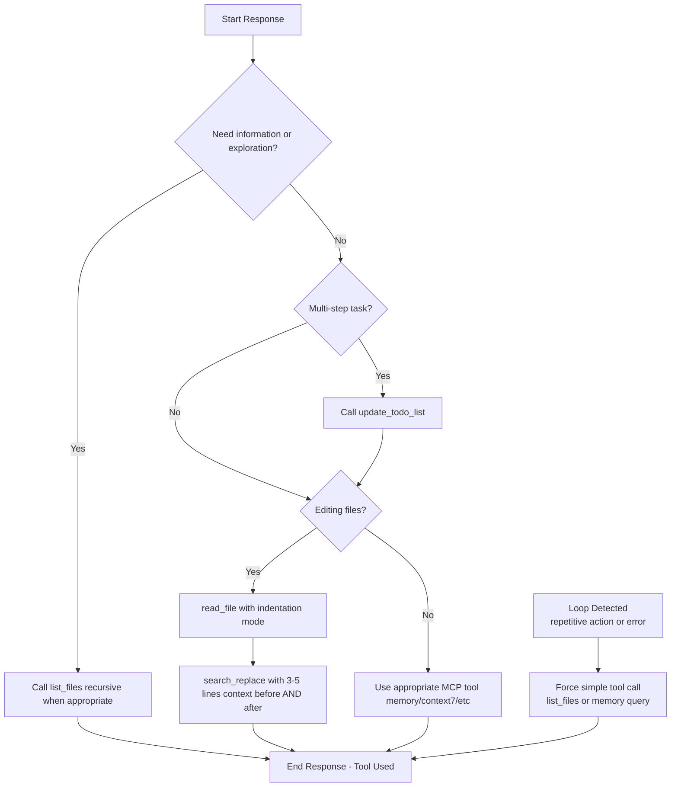

# Improved Tool Calling Decision Flow for Roo

## Overview
This document captures the enhanced decision process added to tool-orchestrator.md and system prompts to prevent looping and ensure consistent tool usage.

## Mermaid Diagram

## Key Rules Enforced
- **Mandatory Tool Call**: Every response without exception
- **Anti-Loop Trigger**: On repetitive behavior or "did not use tool" error → immediate tool call
- **Exploration Priority**: Always start with list_files
- **Memory Integration**: Query and update memory graph on complex tasks
- **Todo Tracking**: update_todo_list on any task with >1 step

This flow has been integrated into:
- `.kilocode/skills/tool-orchestrator.md`
- `.roo/rules-code/skills/tool-orchestrator.md` 
- `.kilocode/system-prompt-code`
- `.roo/rules-code/system-prompt.md`
- `.kilocode/skills/memory-manager.md`
- `.kilocode/workflows/improve-roo.md`

The improvements should significantly reduce looping and tool-usage errors in the inside environment.